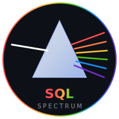

# Spectrum SQL Checker



面向 Java / MyBatis / 存量复杂代码库的 SQL 诊断报告工具。

它不是只把规则命中列表吐出来，而是把扫描结果整理成技术负责人能快速判断的诊断报告：风险在哪里、先修什么、为什么、证据是什么、下一步怎么验证。


## Current Scope

Spectrum SQL Checker 当前聚焦一个闭环：真实扫描代码库，提取 SQL，进行静态规则诊断，可选执行安全 EXPLAIN，然后输出 HTML + JSON 双产物。

已完成的核心能力：

- 真实扫描入口：CLI 统一走 `ScanOrchestratorImpl`，避免报告基于 mock 数据。
- 多来源 SQL 提取：Java 字符串、MyBatis 注解、JPA 注解、MyBatis XML、`.sql`、JavaScript / TypeScript 字符串。
- SQL 预处理：模板占位符修正、抽象 SQL、归一化 SQL、解析状态、EXPLAIN 可执行性分类。
- 静态规则：内置 20 条规则，覆盖危险 DML、全表风险、可维护性、潜在注入和常见性能坏味道。
- 安全 EXPLAIN：默认关闭；启用后只对安全 SQL 做只读 EXPLAIN，拒绝危险语句和不安全模板。
- 专业报告：单文件 HTML 报告，包含总览、热点、洞察、修复队列、明细筛选和证据说明。
- 机器数据：同目录生成 JSON，HTML 和 JSON 使用同一份 `DiagnosticReport` 模型。
- 修复闭环：生成 remediation campaigns、tasks、recipes，给出优先级、置信度、验收口径和修复建议。

暂不承诺的能力：

- 历史报告对比。
- 完整专家系统级 SQL 调优。
- 全数据库深度适配。当前以 MySQL / H2 能力为主，PostgreSQL 主要保证 EXPLAIN 安全策略不退化。

## Quick Start

### 1. Build

```bash
mvn -q -DskipTests clean package
```

生成物：

```text
target/sql-checker-1.2.0.jar
```

### 2. Scan A Codebase

推荐在 CLI 扫描时使用内存 H2，避免本地 `data/sqlchecker.mv.db` 被其他进程占用导致启动失败。

```bash
java -Dspring.datasource.url=jdbc:h2:mem:sqlchecker \
  -jar target/sql-checker-1.2.0.jar scan \
  -p /path/to/project \
  -o target/sql-report/report.html
```

命令会生成：

```text
target/sql-report/report.html
target/sql-report/report.json
```

### 3. Enable EXPLAIN

EXPLAIN 默认关闭。启用前需要准备 `sqlchecker.yml` 并显式打开数据库连接自动初始化。

`--schema-path` 不只服务于 EXPLAIN 初始化，也会被离线 DDL 关联分析使用。即使不连接数据库，也可以把业务代码目录和外置 DDL 目录分开传入：

```bash
java -jar target/sql-checker-1.2.0.jar scan \
  -p /path/to/java-service \
  -o target/sql-report/report.html \
  --schema-path /path/to/ddl
```

报告会在 `DDL 关联风险分析` 中展示实际 DDL 证据源、表覆盖、缺失 DDL 表和疑似未索引谓词。没有发现 DDL 时，工具只给出全局证据缺口提示，不会把每张引用表刷成噪声风险。

```bash
java -Dspring.datasource.url=jdbc:h2:mem:sqlchecker \
  -Dsqlchecker.database.auto-init=true \
  -jar target/sql-checker-1.2.0.jar scan \
  -p /path/to/project \
  -o target/sql-report/report.html \
  --enable-explain \
  --db-connection default
```

如果希望从扫描目录或指定目录推断 DDL 并初始化 schema：

```bash
java -Dspring.datasource.url=jdbc:h2:mem:sqlchecker \
  -Dsqlchecker.database.auto-init=true \
  -jar target/sql-checker-1.2.0.jar scan \
  -p /path/to/project \
  -o target/sql-report/report.html \
  --enable-explain \
  --db-connection default \
  --init-schema \
  --schema-path /path/to/ddl
```

### 4. CLI Help

```bash
java -jar target/sql-checker-1.2.0.jar --help
java -Dspring.datasource.url=jdbc:h2:mem:sqlchecker -jar target/sql-checker-1.2.0.jar scan --help
```

`scan --help` 会启动 Spring 上下文；如果不覆盖 datasource，可能会访问默认文件型 H2。

## CLI Options

```text
scan
  -p, --path             Codebase path to scan. Default: .
  -o, --output           HTML report output path. Default: reports/sql-checker-report.html
      --enable-explain   Enable EXPLAIN analysis.
      --db-connection    Database connection id. Default: default
      --init-schema      Initialize database schema before EXPLAIN.
      --schema-path      DDL path. Default: same as scan path
      --no-progress      Disable progress display.
  -v, --verbose          Verbose output.
```

## Configuration

`sqlchecker.yml` 查找顺序：

1. 当前目录 `sqlchecker.yml`
2. 用户目录 `~/.sqlchecker.yml`
3. classpath 中的默认配置

最小 MySQL 示例：

```yaml
database:
  connections:
    default:
      type: mysql
      host: 127.0.0.1
      port: 3306
      database: app_db
      username: app_user
      password: app_password
      parameters:
        useSSL: false
        serverTimezone: UTC

analysis:
  thresholds:
    scan-rows: 10000
    explain-timeout: 30

rules:
  SELECT_STAR:
    enabled: true
    severity: WARNING
```

Unix socket 示例：

```yaml
database:
  connections:
    default:
      type: mysql
      host: 127.0.0.1
      port: 3306
      database: app_db
      username: app_user
      password: app_password
      parameters:
        unix_socket: /tmp/mysql.sock
        useSSL: false
        serverTimezone: UTC
```

如果当前 JVM 不支持 Unix Domain Socket，程序会移除 `unix_socket` 并回退到 TCP。

## Report Outputs

HTML 报告面向人阅读，JSON 报告面向流水线和二次分析。

HTML 信息架构：

- Executive Brief：风险结论、置信度、优先动作。
- Overview：总分、风险等级、扫描范围、SQL 数、问题数、解析率、EXPLAIN 覆盖率。
- Hotspots：高风险文件、规则分布、严重级别分布。
- Insights：重复 SQL、解析/模板待确认、EXPLAIN 跳过、危险 DML、潜在注入、全表扫描/无索引。
- Remediation：修复战役、任务队列、修复 recipe、验收 checklist。
- Findings：可筛选明细，每条包含位置、SQL、问题、建议和证据。
- Methodology：评分口径、覆盖率口径、严重级别定义和已知限制。

JSON 顶层结构：

```json
{
  "metadata": {},
  "summary": {},
  "hotspots": {},
  "insights": {},
  "findings": [],
  "diagnostics": {},
  "executiveSummary": {},
  "campaigns": [],
  "confidence": {},
  "methodology": {},
  "remediation": {
    "summary": {},
    "campaigns": [],
    "tasks": [],
    "recipes": []
  }
}
```

几个重要口径：

- `parseRate` 表示 SQL 已被预处理/分类管道接住的比例，不等于业务语义 100% 正确。
- `manualReview` 表示动态模板、不确定规则证据或跳过 EXPLAIN 的人工确认项。
- `skippedExplain` 表示未启用数据库、SQL 非只读、模板占位符不安全、数据库不可用或策略拒绝。
- `remediation.tasks` 是建议的修复队列，不是自动改代码结果。
- `schemaAnalysis` 表示离线 DDL 关联分析结果；`schemaPath` 是实际使用的 DDL 证据目录。

## Rules

当前内置规则：

| Rule | 关注点 |
| --- | --- |
| `SELECT_STAR` | 避免 `SELECT *` |
| `SELECT_WITHOUT_WHERE` | 查询缺少过滤条件 |
| `DELETE_UPDATE_NO_WHERE` | 危险 DML |
| `DROP_TRUNCATE_TABLE` | 高危 DDL / 数据破坏风险 |
| `LIKE_LEADING_WILDCARD` | 前置通配符导致索引失效 |
| `ORDER_BY_WITHOUT_LIMIT` | 大结果集排序风险 |
| `FUNCTION_ON_INDEXED_COLUMN` | 索引列函数包装 |
| `INSERT_WITHOUT_COLUMNS` | INSERT 缺少列清单 |
| `NOT_IN` | `NOT IN` 与 NULL 语义风险 |
| `NULL_COMPARISON` | 错误 NULL 比较 |
| `IMPLICIT_JOIN` | 隐式 JOIN 可维护性风险 |
| `MULTI_COLUMN_OR` | 多列 OR 条件 |
| `MULTI_COLUMN_IN` | 多列 IN 条件 |
| `IN_SUBQUERY` | IN 子查询 |
| `COMPLEX_SUBQUERY` | 复杂子查询 |
| `HAVING_WITHOUT_WHERE` | HAVING 前缺少 WHERE |
| `UNNECESSARY_DISTINCT` | 不必要 DISTINCT |
| `LONG_SQL_STATEMENT` | 超长 SQL |
| `HARDCODED_SECRETS` | 硬编码敏感信息 |
| `MAGIC_NUMBERS` | 魔法数字 |

实际启用状态和严重级别以代码与 `sqlchecker.yml` 规则配置为准。

## Safety Model

默认扫描不需要数据库，仍能生成完整静态报告。

启用 EXPLAIN 后，工具遵循保守策略：

- 只分析被判定为安全的 SQL。
- 拒绝 `INSERT`、`UPDATE`、`DELETE`、`DROP`、`TRUNCATE` 等会改变数据或结构的语句。
- 拒绝无法安全替换占位符的动态模板。
- PostgreSQL 禁止 `EXPLAIN ANALYZE`，只使用只读 EXPLAIN。
- 数据库不可用、配置缺失、schema 缺失不会阻断报告生成，会进入 `diagnostics.skippedExplain` 或 `configWarnings`。

## Architecture

```text
CLI
  -> ScanOrchestrator
    -> file scan
    -> SQL extractors
    -> preprocess / normalize / classify
    -> static rule engine
    -> optional safe EXPLAIN
    -> DiagnosticReportFactory
      -> HTML renderer
      -> JSON serializer
```

主要模块：

- `cli`：Picocli 命令入口。
- `application.scan`：扫描编排和 DTO。
- `infrastructure.extractor`：Java / MyBatis / JS / TS / SQL 提取。
- `infrastructure.preprocess`：模板修正、规范化、解析校验和 EXPLAIN SQL 构造。
- `domain.rule` / `infrastructure.rule`：规则定义、注册和执行。
- `infrastructure.analysis.explain`：执行计划构造、执行和问题识别。
- `infrastructure.report`：报告模型聚合、HTML 渲染和 JSON 序列化。

详细设计文档：

- [PRD](docs/sql-checker-prd.md)
- [ADD](docs/sql-checker-add.md)
- [DDD](docs/sql-checker-ddd.md)
- [Rule Engine Design](docs/sql-checker-rule-engine-design.md)
- [Consulting Report Design](docs/superpowers/specs/2026-05-27-sql-checker-v1-3-consulting-report-design.md)
- [Remediation Loop Design](docs/superpowers/specs/2026-05-27-sql-checker-v1-4-remediation-loop-design.md)

## Validation

常规验证：

```bash
mvn test
mvn -q -DskipTests package
```

CLI 验收示例：

```bash
java -Dspring.datasource.url=jdbc:h2:mem:sqlchecker \
  -jar target/sql-checker-1.2.0.jar scan \
  -p /path/to/project \
  -o target/sql-report/report.html \
  --no-progress
```

验收目标：

- `report.html` 存在且可离线打开。
- `report.json` 存在。
- JSON 包含 `summary`、`hotspots`、`findings`、`diagnostics`、`remediation`。
- HTML 与 JSON 的统计口径一致。

## Known Limits

- 动态 SQL 的“解析覆盖”不是“业务语义完全理解”。报告会把不确定项显式放入人工复核。
- JS / TS 提取以字符串和模板字符串为主，不执行代码流分析。
- 当前报告生成是单次扫描视角，不包含历史趋势和增量 diff。
- 密码仍通过本地明文 YAML 提供，不适合作为公网服务配置方式。
- 默认文件型 H2 可能被并发 CLI 或 IDE 进程锁住；文档中的内存 H2 参数可规避这个问题。

## Roadmap

近期优先级：

1. 提升动态 SQL 识别准确率和模板证据表达。
2. 将 remediation task 与代码位置、owner、修复状态进一步打通。
3. 增加更可靠的 HTML 交互验收和报告视觉回归测试。
4. 增加报告历史对比，回答“本次比上次好了还是坏了”。
5. 扩展 PostgreSQL / Oracle 等数据库的方言规则和 EXPLAIN 解析。

## License

MIT
