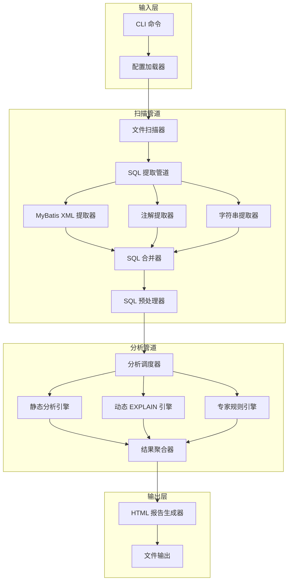
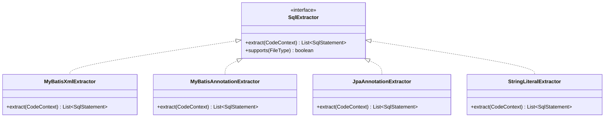
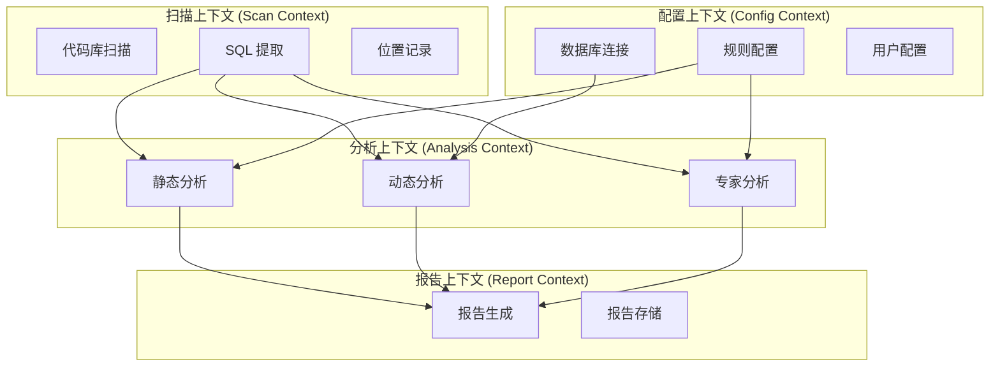
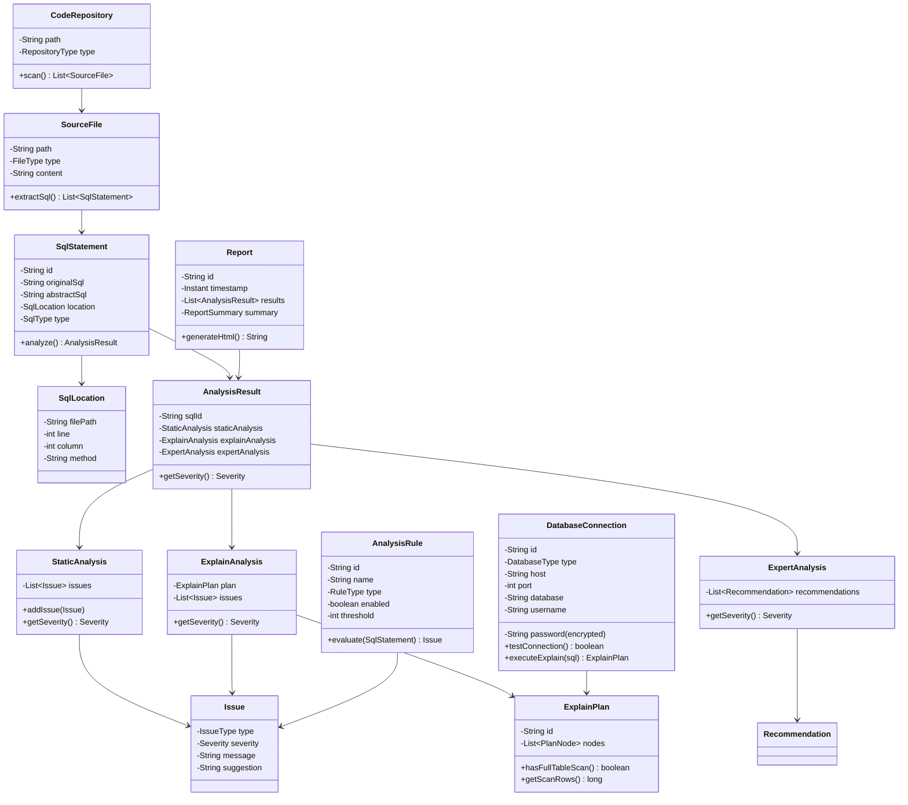
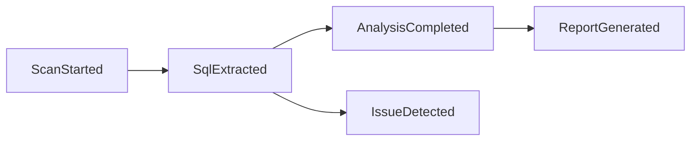
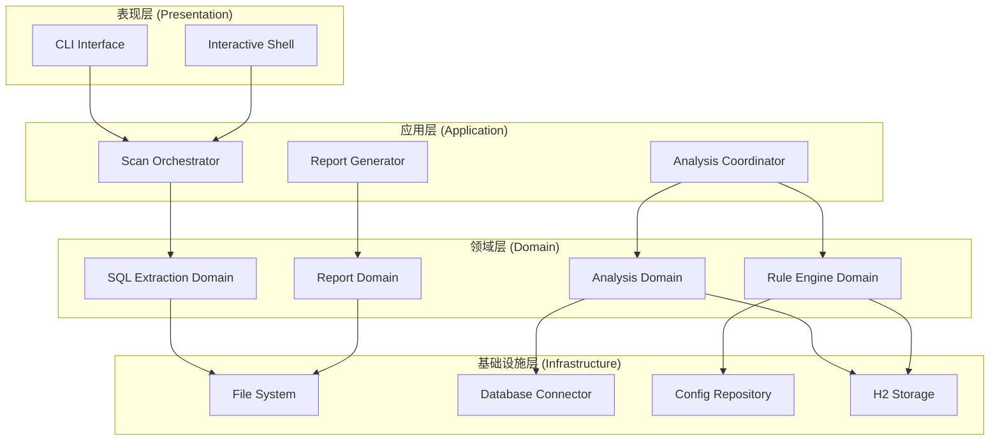
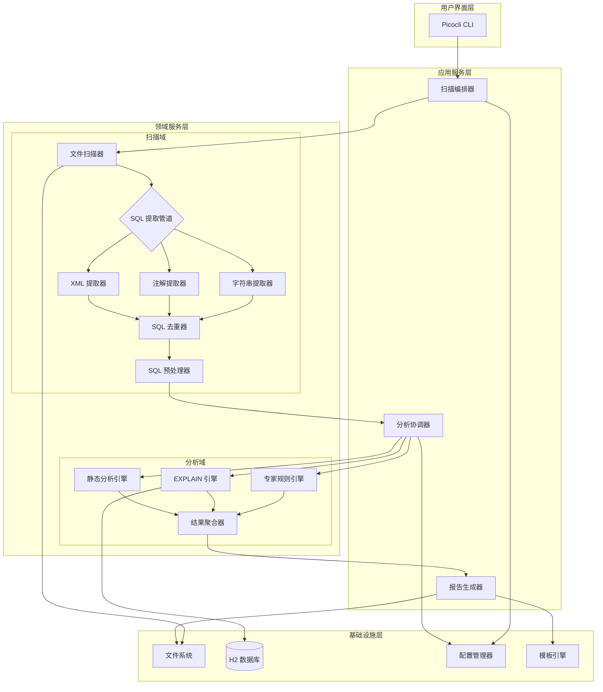
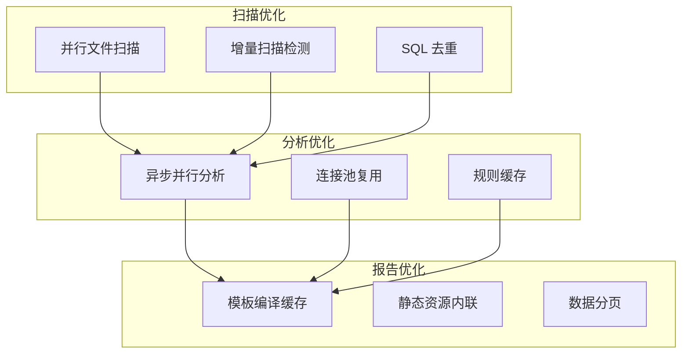
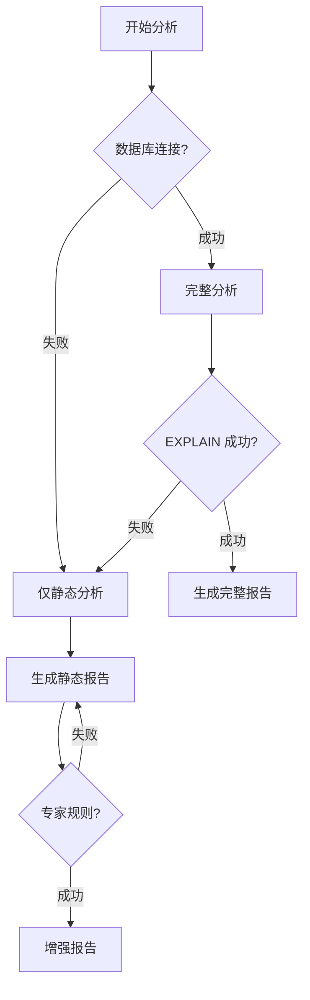

# Spectrum SQL Checker 架构设计文档 (ADD)

## 文档信息

| 字段 | 内容 |
|------|------|
| 项目名称 | Spectrum SQL Code Checker |
| 版本号 | v1.0 (MVP) |
| 创建日期 | 2026-01-23 |
| 架构师 | 系统架构师 |
| 状态 | 草稿 |

---

## 1. 背景

### 1.1 业务分析

Spectrum SQL Checker 是一个面向 Java 后端开发工程师和 DBA 的 SQL 质量检测工具。其核心业务价值在于：

1. **自动化 SQL 发现**：从分散的代码中自动提取各种形式的 SQL 语句
2. **多维度分析**：静态分析 + 动态执行计划 + 专家规则三维度检测
3. **友好输出**：飞书 UI 风格的 HTML 报告

### 1.2 核心用例

| 用例 ID | 用例名称 | 描述 | 优先级 |
|---------|----------|------|--------|
| UC-001 | 扫描代码库 | 扫描 Java 项目，提取所有 SQL 语句 | P0 |
| UC-002 | 静态分析 SQL | 不执行 SQL，检测常见问题模式 | P0 |
| UC-003 | 执行 EXPLAIN | 连接数据库，获取执行计划 | P0 |
| UC-004 | 生成报告 | 输出飞书风格的 HTML 报告 | P0 |
| UC-005 | 配置管理 | 管理数据库连接和分析规则 | P0 |

### 1.3 业务规则

| 规则 ID | 规则描述 |
|---------|----------|
| BR-001 | SQL 识别准确率必须 ≥ 95% |
| BR-002 | 万行代码扫描时间必须 < 30 秒 |
| BR-003 | 密码必须加密存储，不得明文保存 |
| BR-004 | 工具只能只读访问数据库，不得修改数据 |
| BR-005 | 报告中敏感信息必须脱敏处理 |

---

## 2. 架构决策记录 (ADR)

### ADR-001: 技术栈选择

**背景**
- PRD 要求使用 Java 实现
- 需要支持多种 SQL 提取形式（MyBatis XML、注解、字符串）
- 需要连接数据库执行 EXPLAIN
- 需要生成 HTML 报告

**决策**
选择 **Java 17 + Spring Boot 3.2** 作为核心技术栈

**理由**
| 维度 | 选择 | 理由 |
|------|------|------|
| 核心语言 | Java 17 LTS | 长期支持版本，稳定成熟 |
| 应用框架 | Spring Boot 3.2 | 生态成熟，依赖注入简化开发 |
| SQL 解析 | JSqlParser 4.6 | 纯 Java SQL 解析器，支持多数据库 |
| CLI 框架 | Picocli 4.7 | 轻量级，注解驱动，易用 |
| 模板引擎 | Pebble 3.2 | 语法简洁，性能优于 Thymeleaf |
| 配置管理 | SnakeYAML 2.0 | YAML 解析标准库 |
| 数据库连接 | HikariCP | Spring Boot 默认，性能最优 |
| 测试框架 | JUnit 5 + Mockito | 标准组合 |

**后果**
- 正面：Spring Boot 生态丰富，社区支持好
- 正面：JSqlParser 成熟稳定，MySQL/PostgreSQL 都支持
- 负面：Spring Boot 启动开销约 1-2 秒（可接受）
- 负面：需要处理 Spring 依赖冲突

---

### ADR-002: 架构模式选择

**背景**
- 工具需要多个独立的分析能力（静态、动态、专家）
- 各分析器需要可扩展、可测试
- 未来可能支持更多数据库类型

**决策**
采用 **管道（Pipeline）+ 责任链模式**

**架构图**


**理由**
- 管道模式：数据流向清晰，每步独立处理
- 责任链模式：分析器可灵活插拔
- 易于扩展：新增数据库只需新增提取器

**后果**
- 正面：各组件职责单一，易于测试
- 正面：新增分析器不影响现有代码
- 负面：管道过多可能增加调试复杂度

---

### ADR-003: 数据存储选择

**背景**
- 需要存储：数据库连接配置、分析历史、用户配置
- 数据量小，单机使用为主
- 不需要分布式存储

**决策**
采用 **嵌入式 H2 数据库 + YAML 配置文件** 混合方案

| 数据类型 | 存储方式 | 理由 |
|----------|----------|------|
| 数据库连接 | H2 数据库（加密） | 结构化查询，支持复杂关系 |
| 分析历史 | H2 数据库 | 便于对比分析 |
| 分析规则配置 | YAML 文件 | 人类可读，版本控制友好 |
| 用户配置 | YAML 文件 | 易于手动编辑 |

**理由**
- H2 是纯 Java 嵌入式数据库，零配置
- 文件存储便于迁移和备份
- YAML 适合配置管理

**后果**
- 正面：零外部依赖，单文件即可运行
- 正面：配置文件可直接纳入版本控制
- 负面：H2 并发性能有限（单机场景可接受）

---

### ADR-004: SQL 解析方案

**背景**
- 需要解析多种形式的 SQL（MyBatis XML、注解、字符串）
- 需要提取参数化 SQL 模板
- 需要分析 SQL 结构（SELECT 字段、WHERE 条件等）

**决策**
采用 **JSqlParser + 自定义提取器** 组合方案

**方案对比**

| 方案 | 优势 | 劣势 | 评分 |
|------|------|------|------|
| JSqlParser | 纯 Java、多数据库支持、API 清晰 | 对不标准 SQL 兼容性一般 | ⭐⭐⭐⭐⭐ |
| Apache Calcite | 功能强大、可扩展 | 重量级、学习曲线陡 | ⭐⭐⭐ |
| 正则表达式 | 轻量级 | 不可靠、难以维护 | ⭐⭐ |
| ANTLR 自定义 | 完全控制 | 开发成本高 | ⭐⭐⭐ |

**SQL 提取器架构**


**补充决策：SQL 预处理与 Explain 适配**

**背景**
- EXPLAIN 需要可执行 SQL，但扫描得到的 SQL 往往包含占位符、动态片段或不完整结构
- MyBatis 动态 SQL、字符串拼接在解析阶段容易产生不可执行模板

**决策**
在提取与分析之间新增 **SQL 预处理阶段**，完成：
1) SQL 分类（来源/结构）
2) 合法性校验（JSqlParser 解析）
3) 规范化/格式化（空白与关键字统一）
4) Explain 适配（安全替换占位符与动态结构兜底）

**后果**
- 正面：Explain 可执行率显著提升，失败原因可追踪
- 正面：MyBatis/字符串拼接具备专项修复策略
- 负面：增加一次处理步骤与持久化开销（可接受）

---

## 3. 技术选型

### 3.1 技术选型评分矩阵

| 技术栈 | 选项 | 成熟度 | 社区支持 | 团队能力 | 性能 | 总分 | 选择 |
|--------|------|--------|----------|----------|------|------|------|
| Java 版本 | Java 11 | 5 | 5 | 5 | 4 | 19 | |
| | Java 17 | 5 | 5 | 5 | 5 | **20** | ✅ |
| | Java 21 | 4 | 4 | 3 | 5 | 16 | |
| Web 框架 | Spring Boot | 5 | 5 | 5 | 4 | **19** | ✅ |
| | Micronaut | 4 | 3 | 2 | 5 | 14 | |
| | Quarkus | 4 | 3 | 2 | 5 | 14 | |
| CLI 框架 | Picocli | 5 | 4 | 5 | 5 | **19** | ✅ |
| | Spring Shell | 4 | 4 | 4 | 3 | 15 | |
| | JLine | 4 | 4 | 3 | 4 | 15 | |
| SQL 解析 | JSqlParser | 5 | 4 | 4 | 4 | **17** | ✅ |
| | Apache Calcite | 5 | 4 | 2 | 4 | 15 | |

### 3.2 技术栈清单

```yaml
核心技术栈:
  Java:
    版本: JDK 17 LTS
    供应商: Eclipse Temurin / Azul Zulu
    理由: 长期支持，稳定成熟

  框架:
    名称: Spring Boot
    版本: 3.2.x
    理由: 生态成熟，依赖管理便捷

依赖库:
  CLI:
    - picocli:4.7.5
    - jline:3.24.1 (可选，高级终端功能)

  SQL 解析:
    - jsoup:1.17.2 (XML 解析)
    - jsqlparser:4.6+ (SQL 解析)

  数据库:
    - HikariCP:5.1.0 (连接池)
    - H2:2.2.224 (嵌入式存储)
    - mysql-connector-j:8.2.0 (MySQL 驱动)

  模板引擎:
    - io.pebble:pebble:3.2.1

  配置:
    - snakeyaml:2.0

  工具类:
    - apache commons:commons-lang3:3.14.0
    - google guava:33.0.0-jre
    - lombok:1.18.30 (编译时)

测试框架:
  单元测试:
    - junit:junit-jupiter:5.10.2
    - org.mockito:mockito-core:5.11.0

  集成测试:
    - org.testcontainers:testcontainers:1.19.7 (MySQL)
    - org.assertj:assertj-core:3.25.3
```

### 3.3 技术选型理由

#### 3.3.1 Java 17 vs Java 21

| 对比项 | Java 17 | Java 21 |
|--------|---------|---------|
| LTS 支持 | ✅ | ✅ |
| 虚拟线程 | ❌ | ✅ |
| 模式匹配 | 部分支持 | 更完善 |
| 生态兼容性 | 广泛 | 部分库不兼容 |
| 团队熟悉度 | 高 | 中 |

**结论**：选择 Java 17，稳定性和生态兼容性优先

#### 3.3.2 Spring Boot vs Micronaut

| 对比项 | Spring Boot | Micronaut |
|--------|-------------|-----------|
| 启动速度 | ~2s | ~1s |
| 内存占用 | ~100MB | ~80MB |
| 生态成熟度 | 成熟 | 成长中 |
| 团队熟悉度 | 高 | 低 |
| 注解处理器 | 编译时 | 编译时 |

**结论**：选择 Spring Boot，生态和团队能力优先

---

## 4. 领域建模

### 4.1 领域划分



### 4.2 核心领域模型



### 4.3 限界上下文

| 上下文 | 核心领域 | 聚合根 | 主要功能 |
|--------|----------|--------|----------|
| 扫描上下文 | 代码扫描 | SourceFile | 文件扫描、SQL 提取 |
| 分析上下文 | SQL 分析 | AnalysisResult | 静态分析、EXPLAIN、专家规则 |
| 报告上下文 | 报告生成 | Report | HTML 生成、报告存储 |
| 配置上下文 | 配置管理 | DatabaseConnection, AnalysisRule | 连接管理、规则配置 |

### 4.4 核心领域事件



| 事件 | 触发条件 | 携带数据 |
|------|----------|----------|
| ScanStarted | 用户发起扫描 | repositoryPath, timestamp |
| SqlExtracted | 提取到 SQL 语句 | sqlId, abstractSql, location |
| IssueDetected | 检测到问题 | sqlId, issueType, severity |
| AnalysisCompleted | 分析完成 | sqlId, result |
| ReportGenerated | 报告生成完成 | reportPath, summary |

---

## 5. 架构设计

### 5.1 架构原则

1. **单一职责**：每个组件只负责一个功能领域
2. **开闭原则**：对扩展开放，对修改关闭
3. **依赖倒置**：高层模块不依赖低层模块，都依赖抽象
4. **接口隔离**：客户端不依赖不需要的接口
5. **迪米特法则**：最少知识原则

### 5.2 分层架构



### 5.3 系统架构图



### 5.4 包结构设计

```
org.spectrum.sqlchecker
├── cli                        # CLI 入口
│   ├── commands               # Picocli 命令定义
│   └── shell                  # 交互式 Shell
├── application                # 应用服务层
│   ├── scan                   # 扫描编排
│   ├── preprocess             # SQL 预处理
│   ├── analysis               # 分析协调
│   └── report                 # 报告生成
├── domain                     # 领域层
│   ├── scanner                # 扫描域
│   │   ├── model              # 领域模型
│   │   ├── extractor          # SQL 提取器
│   │   └── service            # 领域服务
│   ├── preprocess             # 预处理域
│   │   ├── model              # 领域模型
│   │   └── service            # 领域服务
│   ├── analysis               # 分析域
│   │   ├── model              # 领域模型
│   │   ├── static             # 静态分析
│   │   ├── explain            # EXPLAIN 分析
│   │   ├── expert             # 专家规则
│   │   └── service            # 领域服务
│   ├── report                 # 报告域
│   │   ├── model              # 领域模型
│   │   └── generator          # 报告生成器
│   └── config                 # 配置域
│       ├── model              # 领域模型
│       └── repository         # 配置仓储
├── infrastructure             # 基础设施层
│   ├── persistence            # 持久化
│   │   ├── h2                 # H2 实现
│   │   └── jpa                # JPA 实现
│   ├── database               # 数据库连接
│   │   ├── mysql              # MySQL 实现
│   │   └── postgresql         # PostgreSQL 实现
│   ├── config                 # 配置加载
│   │   └── yaml               # YAML 实现
│   └── template               # 模板引擎
│       └── pebble             # Pebble 实现
└── shared                     # 共享组件
    ├── event                  # 领域事件
    ├── util                   # 工具类
    └── exception              # 异常定义
```

---

## 6. 数据模型

### 6.1 核心领域模型映射

为支持 Explain 适配与失败原因追踪，引入 `SQL_PREPROCESS_RESULT` 用于记录分类、规范化 SQL 与 Explain SQL。

```mermaid
erDiagram
    CODE_REPOSITORY ||--o{ SOURCE_FILE : contains
    SOURCE_FILE ||--o{ SQL_STATEMENT : contains
    SQL_STATEMENT ||--|| SQL_LOCATION : has
    SQL_STATEMENT ||--o{ SQL_PREPROCESS_RESULT : preprocesses
    SQL_STATEMENT ||--o{ ANALYSIS_RESULT : produces
    ANALYSIS_RESULT ||--|| STATIC_ANALYSIS : has
    ANALYSIS_RESULT ||--|| EXPLAIN_ANALYSIS : has
    ANALYSIS_RESULT ||--|| EXPERT_ANALYSIS : has
    REPORT ||--o{ ANALYSIS_RESULT : contains
    DATABASE_CONNECTION ||--o{ EXPLAIN_ANALYSIS : executes

    CODE_REPOSITORY {
        string id PK
        string path
        string type
        timestamp created_at
    }

    SOURCE_FILE {
        string id PK
        string repo_id FK
        string path
        string file_type
        bigint line_count
        timestamp scanned_at
    }

    SQL_STATEMENT {
        string id PK
        string file_id FK
        string abstract_sql
        string original_sql
        string sql_type
        int line_number
        string method_name
    }

    SQL_LOCATION {
        string id PK
        string sql_id FK
        string file_path
        int line
        int column
        string class_name
        string method_name
    }

    SQL_PREPROCESS_RESULT {
        string id PK
        string sql_id FK
        string category
        string normalized_sql
        string explain_sql
        string validity
        string explain_eligibility
        string error_reason
        timestamp created_at
    }

    ANALYSIS_RESULT {
        string id PK
        string sql_id FK
        timestamp created_at
        string severity
    }

    STATIC_ANALYSIS {
        string id PK
        string result_id FK
        json issues
        string severity
    }

    EXPLAIN_ANALYSIS {
        string id PK
        string result_id FK
        json explain_plan
        json issues
        string severity
    }

    EXPERT_ANALYSIS {
        string id PK
        string result_id FK
        json recommendations
        string severity
    }

    REPORT {
        string id PK
        string repo_id FK
        string file_path
        timestamp created_at
        json summary
    }

    DATABASE_CONNECTION {
        string id PK
        string name
        string type
        string host
        int port
        string database
        string username
        string password_encrypted
    }

    ANALYSIS_RULE {
        string id PK
        string name
        string rule_type
        boolean enabled
        int threshold
        json config
    }
```



### 6.2 数据表设计 (DDL)

#### 6.2.1 扫描域表

```sql
-- 代码库表
CREATE TABLE code_repository (
    id VARCHAR(36) PRIMARY KEY,
    path VARCHAR(1024) NOT NULL,
    type VARCHAR(50) NOT NULL,
    created_at TIMESTAMP DEFAULT CURRENT_TIMESTAMP,
    INDEX idx_path (path)
);

-- 源文件表
CREATE TABLE source_file (
    id VARCHAR(36) PRIMARY KEY,
    repo_id VARCHAR(36) NOT NULL,
    path VARCHAR(1024) NOT NULL,
    file_type VARCHAR(50) NOT NULL,
    line_count BIGINT,
    scanned_at TIMESTAMP DEFAULT CURRENT_TIMESTAMP,
    FOREIGN KEY (repo_id) REFERENCES code_repository(id),
    INDEX idx_repo (repo_id),
    INDEX idx_type (file_type)
);

-- SQL 语句表
CREATE TABLE sql_statement (
    id VARCHAR(36) PRIMARY KEY,
    file_id VARCHAR(36) NOT NULL,
    abstract_sql TEXT NOT NULL,
    original_sql TEXT NOT NULL,
    sql_type VARCHAR(50) NOT NULL,
    line_number INT,
    method_name VARCHAR(255),
    hash VARCHAR(64) NOT NULL,
    created_at TIMESTAMP DEFAULT CURRENT_TIMESTAMP,
    FOREIGN KEY (file_id) REFERENCES source_file(id),
    INDEX idx_file (file_id),
    INDEX idx_hash (hash)
);

-- SQL 位置表
CREATE TABLE sql_location (
    id VARCHAR(36) PRIMARY KEY,
    sql_id VARCHAR(36) NOT NULL,
    file_path VARCHAR(1024) NOT NULL,
    line INT NOT NULL,
    column INT,
    class_name VARCHAR(512),
    method_name VARCHAR(255),
    FOREIGN KEY (sql_id) REFERENCES sql_statement(id),
    INDEX idx_sql (sql_id)
);

-- SQL 预处理结果表
CREATE TABLE sql_preprocess_result (
    id VARCHAR(36) PRIMARY KEY,
    sql_id VARCHAR(36) NOT NULL,
    category VARCHAR(64) NOT NULL,
    normalized_sql TEXT NOT NULL,
    explain_sql TEXT,
    validity VARCHAR(16) NOT NULL,
    explain_eligibility VARCHAR(16) NOT NULL,
    error_reason TEXT,
    created_at TIMESTAMP DEFAULT CURRENT_TIMESTAMP,
    FOREIGN KEY (sql_id) REFERENCES sql_statement(id),
    INDEX idx_preprocess_sql (sql_id),
    INDEX idx_preprocess_category (category)
);
```

#### 6.2.2 分析域表

```sql
-- 分析结果表
CREATE TABLE analysis_result (
    id VARCHAR(36) PRIMARY KEY,
    sql_id VARCHAR(36) NOT NULL,
    scan_id VARCHAR(36),
    severity VARCHAR(20) NOT NULL,
    created_at TIMESTAMP DEFAULT CURRENT_TIMESTAMP,
    FOREIGN KEY (sql_id) REFERENCES sql_statement(id),
    INDEX idx_sql (sql_id),
    INDEX idx_severity (severity),
    INDEX idx_scan (scan_id)
);

-- 静态分析表
CREATE TABLE static_analysis (
    id VARCHAR(36) PRIMARY KEY,
    result_id VARCHAR(36) NOT NULL,
    issues JSON NOT NULL,
    severity VARCHAR(20) NOT NULL,
    FOREIGN KEY (result_id) REFERENCES analysis_result(id)
);

-- EXPLAIN 分析表
CREATE TABLE explain_analysis (
    id VARCHAR(36) PRIMARY KEY,
    result_id VARCHAR(36) NOT NULL,
    explain_plan JSON NOT NULL,
    issues JSON,
    severity VARCHAR(20) NOT NULL,
    FOREIGN KEY (result_id) REFERENCES analysis_result(id)
);

-- 专家分析表
CREATE TABLE expert_analysis (
    id VARCHAR(36) PRIMARY KEY,
    result_id VARCHAR(36) NOT NULL,
    recommendations JSON NOT NULL,
    severity VARCHAR(20) NOT NULL,
    FOREIGN KEY (result_id) REFERENCES analysis_result(id)
);
```

#### 6.2.3 配置域表

```sql
-- 数据库连接表
CREATE TABLE database_connection (
    id VARCHAR(36) PRIMARY KEY,
    name VARCHAR(255) NOT NULL,
    type VARCHAR(50) NOT NULL,
    host VARCHAR(255) NOT NULL,
    port INT NOT NULL,
    database_name VARCHAR(255) NOT NULL,
    username VARCHAR(255) NOT NULL,
    password_encrypted TEXT NOT NULL,
    created_at TIMESTAMP DEFAULT CURRENT_TIMESTAMP,
    updated_at TIMESTAMP DEFAULT CURRENT_TIMESTAMP ON UPDATE CURRENT_TIMESTAMP
);

-- 分析规则表
CREATE TABLE analysis_rule (
    id VARCHAR(36) PRIMARY KEY,
    name VARCHAR(255) NOT NULL,
    rule_type VARCHAR(50) NOT NULL,
    enabled BOOLEAN DEFAULT TRUE,
    threshold INT,
    config JSON,
    description TEXT,
    created_at TIMESTAMP DEFAULT CURRENT_TIMESTAMP
);

-- 扫描历史表
CREATE TABLE scan_history (
    id VARCHAR(36) PRIMARY KEY,
    repo_id VARCHAR(36) NOT NULL,
    status VARCHAR(50) NOT NULL,
    files_scanned INT,
    sql_found INT,
    issues_found INT,
    duration_ms BIGINT,
    started_at TIMESTAMP,
    completed_at TIMESTAMP,
    FOREIGN KEY (repo_id) REFERENCES code_repository(id),
    INDEX idx_repo (repo_id),
    INDEX idx_status (status)
);
```

### 6.3 关系映射说明

| 关系 | 类型 | 级联 | 说明 |
|------|------|------|------|
| CodeRepository → SourceFile | 1:N | CASCADE | 删除仓库时删除所有文件记录 |
| SourceFile → SqlStatement | 1:N | CASCADE | 删除文件时删除所有 SQL |
| SqlStatement → AnalysisResult | 1:N | CASCADE | 删除 SQL 时删除所有分析结果 |
| AnalysisResult → Static/Explain/Expert | 1:1 | CASCADE | 结果与分析一对一 |

---

## 7. 非功能设计

### 7.1 性能设计

#### 7.1.1 性能目标与方案

| 性能指标 | 目标值 | 技术方案 |
|----------|--------|----------|
| 万行代码扫描 | < 30 秒 | 并行文件扫描 + 增量扫描 |
| 单条 SQL 分析 | < 500 毫秒 | 异步并行分析 + 连接池 |
| HTML 报告加载 | < 2 秒 | 静态 HTML + 内联 CSS/JS |
| 内存占用 | < 512 MB | 流式处理 + 对象复用 |

#### 7.1.2 性能优化策略



**具体实现**：

1. **并行文件扫描**
   ```java
   ExecutorService executor = Executors.newFixedThreadPool(
       Runtime.getRuntime().availableProcessors()
   );
   List<Future<SourceFile>> futures = files.stream()
       .map(file -> executor.submit(() -> scanFile(file)))
       .toList();
   ```

2. **SQL 去重**
   ```java
   // 使用 SQL 模板哈希去重
   Map<String, SqlStatement> deduped = sqls.stream()
       .collect(toMap(
           sql -> sql.getAbstractHash(),
           Function.identity(),
           (existing, replacement) -> existing
       ));
   ```

3. **异步分析**
   ```java
   CompletableFuture<StaticAnalysis> staticFuture =
       CompletableFuture.supplyAsync(() -> staticAnalyzer.analyze(sql));
   CompletableFuture<ExplainAnalysis> explainFuture =
       CompletableFuture.supplyAsync(() -> explainEngine.analyze(sql));
   // 等待全部完成
   CompletableFuture.allOf(staticFuture, explainFuture).join();
   ```

### 7.2 安全设计

#### 7.2.1 安全威胁与应对

| 威胁 | 风险 | 应对方案 |
|------|------|----------|
| 密码泄露 | 数据库凭证被窃取 | AES-256 加密存储 |
| SQL 注入 | 分析时被注入恶意 SQL | 只读连接 + 参数化查询 |
| 敏感信息泄露 | 报告暴露敏感数据 | 敏感词脱敏 |
| 配置篡改 | 恶意配置导致异常 | 配置校验 + 签名 |

#### 7.2.2 密码加密方案

```java
// AES-256-GCM 加密
public class PasswordEncryptor {
    private static final String ALGORITHM = "AES/GCM/NoPadding";
    private static final int KEY_SIZE = 256;
    private static final int IV_SIZE = 12;

    public String encrypt(String password, String masterKey) {
        // 生成随机 IV
        byte[] iv = new byte[IV_SIZE];
        SecureRandom random = new SecureRandom();
        random.nextBytes(iv);

        // 加密
        Cipher cipher = Cipher.getInstance(ALGORITHM);
        cipher.init(Cipher.ENCRYPT_MODE, deriveKey(masterKey), new GCMParameterSpec(128, iv));

        byte[] encrypted = cipher.doFinal(password.getBytes(UTF_8));
        byte[] combined = Bytes.concat(iv, encrypted);

        return Base64.getEncoder().encodeToString(combined);
    }
}
```

#### 7.2.3 脱敏规则

```java
public class DataMasker {
    private static final List<Pattern> SENSITIVE_PATTERNS = List.of(
        Pattern.compile("(password|passwd|pwd)\\s*=\\s*'[^']*'", CASE_INSENSITIVE),
        Pattern.compile("(secret|key|token)\\s*=\\s*'[^']*'", CASE_INSENSITIVE),
        Pattern.compile("//@[A-Za-z0-9]{32,}") // JWT Token
    );

    public String mask(String sql) {
        String masked = sql;
        for (Pattern pattern : SENSITIVE_PATTERNS) {
            masked = pattern.matcher(masked).replaceAll("$1='***'");
        }
        return masked;
    }
}
```

### 7.3 可用性设计

#### 7.3.1 容错设计

| 故障场景 | 检测 | 恢复 |
|----------|------|------|
| 数据库连接失败 | 连接超时 | 降级为静态分析 |
| 文件读取失败 | IO 异常 | 记录日志，继续其他文件 |
| SQL 解析失败 | 解析异常 | 记录原文，标记为解析失败 |
| 报告生成失败 | 模板错误 | 降级为简化报告 |

#### 7.3.2 降级策略



---

## 8. 架构权衡分析

### 8.1 架构优势

| 优势 | 说明 | 价值 |
|------|------|------|
| 模块化设计 | 清晰的分层和边界 | 易于测试和维护 |
| 可扩展性 | 插件式提取器和分析器 | 易于添加新数据库 |
| 独立部署 | 单文件 JAR，零外部依赖 | 便于分发 |
| 配置驱动 | YAML 配置，易于定制 | 适应不同团队需求 |

### 8.2 架构风险

| 风险 | 影响 | 缓解措施 |
|------|------|----------|
| Spring Boot 启动开销 | 每次运行需 2-3 秒 | 可接受（非高频调用） |
| H2 数据库限制 | 并发能力有限 | 单机使用，无并发场景 |
| JSqlParser 兼容性 | 不标准 SQL 可能解析失败 | 记录失败，降级处理 |
| 规则维护成本 | 规则库需要持续更新 | 社区贡献 + 版本迭代 |

### 8.3 技术债务识别

| 债务项 | 影响 | 计划偿还时间 |
|--------|------|--------------|
| 硬编码的飞书 UI 样式 | UI 修改需改代码 | v1.5 - 外部 CSS 文件 |
| 单机模式限制 | 无法团队协作 | v2.0 - 服务器模式 |
| 有限的数据库支持 | 仅 MySQL/PostgreSQL | v1.5 - 更多数据库 |
| 规则库内嵌 | 自定义规则困难 | v2.0 - 规则插件机制 |

---

## 9. 需求追溯

### 9.1 功能需求追溯

| PRD 需求 | 架构支持 | 设计元素 |
|----------|----------|----------|
| REQ-001 代码库扫描 | ✅ | Scanner, ExtractorPipeline |
| REQ-002 静态分析 | ✅ | StaticAnalyzer |
| REQ-003 动态 EXPLAIN | ✅ | ExplainEngine, DatabaseConnection |
| REQ-004 专家规则 | ✅ | ExpertEngine, AnalysisRule |
| REQ-005 HTML 报告 | ✅ | ReportGenerator, Pebble 模板 |
| REQ-006 交互式 CLI | ✅ | Picocli, InteractiveShell |
| REQ-007 多数据库 | ✅ | DatabaseConnector 接口 |
| REQ-008 配置管理 | ✅ | YamlConfigLoader, H2 Storage |
| REQ-009 历史对比 | ⏳ | ScanHistory (v2.0) |
| REQ-010 CI/CD 集成 | ⏳ | ExitCodeHandler (v2.0) |

### 9.2 非功能需求追溯

| PRD NFR | 架构支持 | 技术方案 |
|---------|----------|----------|
| 万行代码 < 30 秒 | ✅ | 并行扫描 + SQL 去重 |
| 识别准确率 > 95% | ✅ | 多提取器 + JSqlParser |
| 报告加载 < 2 秒 | ✅ | 静态 HTML + 资源内联 |
| 内存 < 512 MB | ✅ | 流式处理 + 对象复用 |
| 密码加密 | ✅ | AES-256-GCM |
| 只读访问 | ✅ | 只读数据源配置 |

---

**文档结束**
