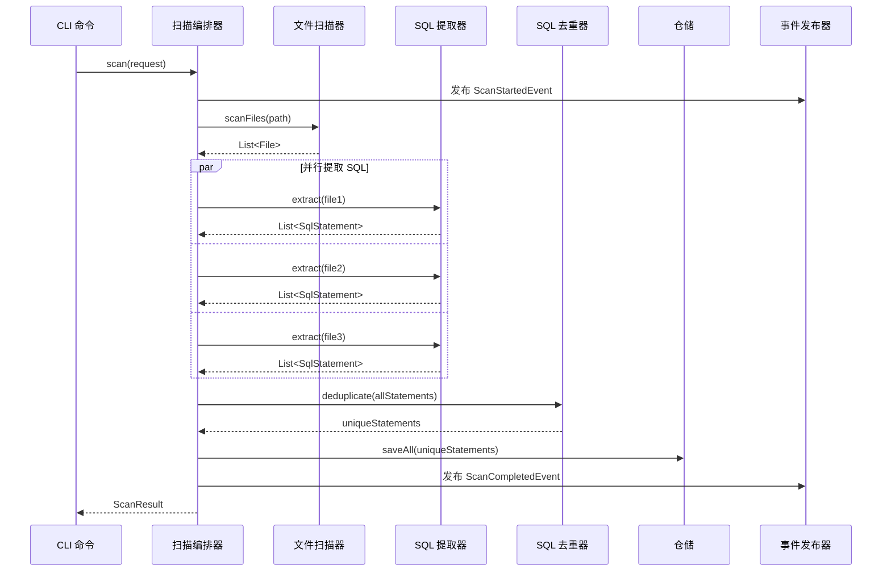
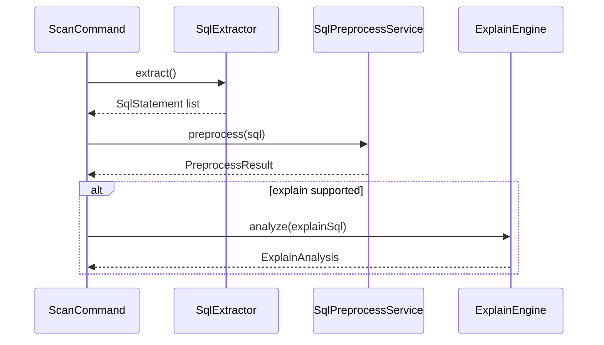

# Spectrum SQL Checker 详细设计文档 (DDD)

## 文档信息

| 字段 | 内容 |
|------|------|
| 项目名称 | Spectrum SQL Code Checker |
| 版本号 | v1.0 (MVP) |
| 创建日期 | 2026-01-23 |
| 设计师 | 系统架构师 |
| 状态 | 草稿 |
| 参考文档 | PRD v1.0, ADD v1.0 |

---

## 文档说明

本文档是对 Spectrum SQL Checker MVP 版本的详细设计，涵盖以下 7 个核心功能模块：

| 模块编号 | 模块名称 | 对应需求 |
|----------|----------|----------|
| M-001 | 扫描模块 | REQ-001 代码库扫描与 SQL 提取 |
| M-001A | SQL 预处理与 Explain 适配 | REQ-001 / REQ-003 |
| M-002 | 静态分析模块 | REQ-002 静态 SQL 分析 |
| M-003 | 动态分析模块 | REQ-003 动态 EXPLAIN 分析 |
| M-004 | 专家规则模块 | REQ-004 专家规则分析 |
| M-005 | 报告生成模块 | REQ-005 HTML 报告生成 |
| M-006 | CLI 交互模块 | REQ-006 交互式命令行界面 |

---

# 模块 M-001：扫描模块

## 1. 功能概述

### 1.1 功能描述

扫描模块负责扫描 Java 代码库，自动识别和提取各种形式的 SQL 语句，包括：
- MyBatis XML 中的 SQL
- MyBatis 注解中的 SQL（@Select、@Update 等）
- JPA @Query 注解中的 SQL
- Java 字符串中的 SQL

### 1.2 用户场景

```
场景：开发工程师想要扫描自己的项目代码
前置条件：代码库路径存在
后置条件：获得 SQL 语句列表
```

### 1.3 前置/后置条件

| 条件类型 | 说明 |
|----------|------|
| 前置条件 | 代码库路径存在且可读 |
| 后置条件 | SQL 语句列表持久化到数据库 |

---

## 2. 接口设计

### 2.1 内部服务接口

由于本模块是内部服务，不直接暴露 REST API，而是通过应用服务层调用。

#### ScanService 应用服务接口

```java
package org.spectrum.sqlchecker.application.scan;

/**
 * 扫描应用服务
 */
public interface ScanService {

    /**
     * 扫描代码库
     * @param request 扫描请求
     * @return 扫描结果
     */
    ScanResult scan(ScanRequest request);

    /**
     * 获取扫描进度
     * @param scanId 扫描ID
     * @return 进度信息
     */
    ScanProgress getProgress(String scanId);

    /**
     * 取消扫描
     * @param scanId 扫描ID
     */
    void cancelScan(String scanId);
}
```

### 2.2 DTO 定义

#### ScanRequest（扫描请求）

```java
package org.spectrum.sqlchecker.application.scan.dto;

import jakarta.validation.constraints.NotBlank;
import jakarta.validation.constraints.NotNull;
import lombok.Data;
import java.util.List;

/**
 * 扫描请求
 */
@Data
public class ScanRequest {

    /**
     * 代码库路径
     */
    @NotBlank(message = "代码库路径不能为空")
    private String repositoryPath;

    /**
     * 扫描范围
     */
    private ScanScope scope = ScanScope.FULL;

    /**
     * 包含的文件模式（Ant 风格）
     */
    private List<String> includes = List.of("**/*.java", "**/*.xml", "**/*.sql");

    /**
     * 排除的文件模式
     */
    private List<String> excludes = List.of("**/target/**", "**/build/**", "**/.git/**");

    /**
     * 项目类型（自动检测，可手动指定）
     */
    private ProjectType projectType;

    /**
     * 是否增量扫描
     */
    private boolean incremental = false;

    /**
     * 增量扫描基准（上次扫描ID）
     */
    private String baselineScanId;

    /**
     * 并行度（0=自动检测）
     */
    private int parallelism = 0;
}
```

#### ScanResult（扫描结果）

```java
package org.spectrum.sqlchecker.application.scan.dto;

import lombok.Data;
import java.util.List;

/**
 * 扫描结果
 */
@Data
public class ScanResult {

    /**
     * 扫描ID
     */
    private String scanId;

    /**
     * 扫描状态
     */
    private ScanStatus status;

    /**
     * 扫描的文件数量
     */
    private int filesScanned;

    /**
     * 发现的 SQL 数量
     */
    private int sqlFound;

    /**
     * 去重后的 SQL 数量
     */
    private int uniqueSqlFound;

    /**
     * 扫描耗时（毫秒）
     */
    private long durationMs;

    /**
     * 提取的 SQL 语句列表
     */
    private List<SqlStatementDto> sqlStatements;

    /**
     * 错误信息列表
     */
    private List<ScanError> errors;
}
```

#### SqlStatementDto（SQL 语句 DTO）

```java
package org.spectrum.sqlchecker.application.scan.dto;

import lombok.Data;
import java.util.List;

/**
 * SQL 语句 DTO
 */
@Data
public class SqlStatementDto {

    /**
     * SQL ID
     */
    private String id;

    /**
     * SQL 类型
     */
    private SqlType sqlType;

    /**
     * 原始 SQL
     */
    private String originalSql;

    /**
     * 抽象 SQL（参数化模板）
     */
    private String abstractSql;

    /**
     * SQL 哈希（用于去重）
     */
    private String sqlHash;

    /**
     * SQL 来源位置列表
     */
    private List<SqlLocationDto> locations;
}
```

#### SqlLocationDto（SQL 位置 DTO）

```java
package org.spectrum.sqlchecker.application.scan.dto;

import lombok.Data;

/**
 * SQL 位置 DTO
 */
@Data
public class SqlLocationDto {

    /**
     * 文件路径
     */
    private String filePath;

    /**
     * 起始行号
     */
    private int startLine;

    /**
     * 结束行号
     */
    private int endLine;

    /**
     * 起始列号
     */
    private int startColumn;

    /**
     * 类名
     */
    private String className;

    /**
     * 方法名
     */
    private String methodName;

    /**
     * 来源类型
     */
    private SqlSourceType sourceType;
}
```

#### ScanProgress（扫描进度）

```java
package org.spectrum.sqlchecker.application.scan.dto;

import lombok.Data;
import java.time.Instant;

/**
 * 扫描进度
 */
@Data
public class ScanProgress {

    /**
     * 扫描ID
     */
    private String scanId;

    /**
     * 扫描状态
     */
    private ScanStatus status;

    /**
     * 当前进度阶段
     */
    private ScanStage stage;

    /**
     * 进度百分比 (0-100)
     */
    private int progress;

    /**
     * 已扫描文件数
     */
    private int filesScanned;

    /**
     * 总文件数
     */
    private int totalFiles;

    /**
     * 已发现 SQL 数量
     */
    private int sqlFound;

    /**
     * 预计剩余时间（秒）
     */
    private long estimatedSecondsRemaining;

    /**
     * 当前处理文件
     */
    private String currentFile;

    /**
     * 开始时间
     */
    private Instant startTime;
}
```

### 2.3 枚举定义

#### ScanStatus（扫描状态）

```java
package org.spectrum.sqlchecker.domain.shared.enumeration;

/**
 * 扫描状态
 */
public enum ScanStatus {

    /**
     * 待执行
     */
    PENDING,

    /**
     * 扫描中
     */
    SCANNING,

    /**
     * 分析中
     */
    ANALYZING,

    /**
     * 已完成
     */
    COMPLETED,

    /**
     * 已取消
     */
    CANCELLED,

    /**
     * 失败
     */
    FAILED
}
```

#### ScanStage（扫描阶段）

```java
package org.spectrum.sqlchecker.domain.shared.enumeration;

/**
 * 扫描阶段
 */
public enum ScanStage {

    /**
     * 初始化
     */
    INITIALIZING,

    /**
     * 文件扫描
     */
    FILE_SCANNING,

    /**
     * SQL 提取
     */
    SQL_EXTRACTION,

    /**
     * SQL 去重
     */
    SQL_DEDUPLICATION,

    /**
     * 静态分析
     */
    STATIC_ANALYSIS,

    /**
     * EXPLAIN 分析
     */
    EXPLAIN_ANALYSIS,

    /**
     * 专家规则分析
     */
    EXPERT_ANALYSIS,

    /**
     * 报告生成
     */
    REPORT_GENERATING
}
```

#### ScanScope（扫描范围）

```java
package org.spectrum.sqlchecker.domain.shared.enumeration;

/**
 * 扫描范围
 */
public enum ScanScope {

    /**
     * 全部
     */
    FULL,

    /**
     * 仅 src 目录
     */
    SRC_ONLY,

    /**
     * 仅 main 源码
     */
    MAIN_ONLY,

    /**
     * 自定义路径
     */
    CUSTOM
}
```

#### SqlType（SQL 类型）

```java
package org.spectrum.sqlchecker.domain.shared.enumeration;

/**
 * SQL 类型
 */
public enum SqlType {

    /**
     * SELECT
     */
    SELECT,

    /**
     * INSERT
     */
    INSERT,

    /**
     * UPDATE
     */
    UPDATE,

    /**
     * DELETE
     */
    DELETE,

    /**
     * CREATE
     */
    CREATE,

    /**
     * ALTER
     */
    ALTER,

    /**
     * DROP
     */
    DROP,

    /**
     * 其他（TRUNCATE、SHOW 等）
     */
    OTHER
}
```

#### SqlSourceType（SQL 来源类型）

```java
package org.spectrum.sqlchecker.domain.shared.enumeration;

/**
 * SQL 来源类型
 */
public enum SqlSourceType {

    /**
     * MyBatis XML
     */
    MYBATIS_XML,

    /**
     * MyBatis 注解
     */
    MYBATIS_ANNOTATION,

    /**
     * JPA @Query 注解
     */
    JPA_ANNOTATION,

    /**
     * 字符串拼接
     */
    STRING_LITERAL,

    /**
     * SQL 文件
     */
    SQL_FILE
}
```

### 2.4 错误码定义

| 错误码 | 说明 | HTTP 状态码 |
|--------|------|-------------|
| SCAN_001 | 代码库路径不存在 | 400 |
| SCAN_002 | 代码库路径不可读 | 403 |
| SCAN_003 | 扫描被取消 | 200 |
| SCAN_004 | 扫描超时 | 408 |
| SCAN_005 | 文件解析失败 | 200（非致命） |

---

## 3. 数据库设计

### 3.1 表结构

扫描模块相关的表在 ADD 中已定义，此处补充索引设计：

#### sql_statement 表（补充索引）

```sql
-- 按扫描时间查询（增量扫描）
CREATE INDEX idx_created_at ON sql_statement(created_at);

-- 按类型查询
CREATE INDEX idx_sql_type ON sql_statement(sql_type);

-- 组合索引（文件+行号）
CREATE INDEX idx_file_line ON sql_statement(file_id, line_number);
```

---

## 4. 领域模型设计

### 4.1 聚合根

#### SourceFile（源文件）

```java
package org.spectrum.sqlchecker.domain.scanner.model;

import lombok.Getter;
import org.spectrum.sqlchecker.domain.shared.aggregate.AggregateRoot;
import org.spectrum.sqlchecker.domain.shared.valueobject.FilePath;
import org.spectrum.sqlchecker.domain.shared.valueobject.FileType;
import org.spectrum.sqlchecker.domain.scanner.exception.SqlExtractionException;
import java.util.ArrayList;
import java.util.List;

/**
 * 源文件聚合根
 */
@Getter
public class SourceFile extends AggregateRoot {

    /**
     * 文件路径（值对象）
     */
    private final FilePath path;

    /**
     * 文件类型（值对象）
     */
    private final FileType type;

    /**
     * 文件内容
     */
    private String content;

    /**
     * 提取的 SQL 语句
     */
    private final List<SqlStatement> sqlStatements = new ArrayList<>();

    /**
     * 行数
     */
    private int lineCount;

    public SourceFile(FilePath path, FileType type, String content) {
        this.path = path;
        this.type = type;
        this.content = content;
        this.lineCount = content.split("\n").length;
    }

    /**
     * 添加 SQL 语句
     */
    public void addSqlStatement(SqlStatement sqlStatement) {
        this.sqlStatements.add(sqlStatement);
    }

    /**
     * 提取 SQL（委托给提取器）
     */
    public List<SqlStatement> extractSql(SqlExtractor extractor) throws SqlExtractionException {
        return extractor.extract(this);
    }

    /**
     * 是否为 XML 文件
     */
    public boolean isXml() {
        return type.isXml();
    }

    /**
     * 是否为 Java 文件
     */
    public boolean isJava() {
        return type.isJava();
    }
}
```

#### SqlStatement（SQL 语句）

```java
package org.spectrum.sqlchecker.domain.scanner.model;

import lombok.Getter;
import org.spectrum.sqlchecker.domain.shared.aggregate.AggregateRoot;
import org.spectrum.sqlchecker.domain.shared.enumeration.SqlType;
import org.spectrum.sqlchecker.domain.shared.valueobject.SqlHash;
import org.spectrum.sqlchecker.domain.shared.valueobject.AbstractSql;
import org.spectrum.sqlchecker.domain.shared.valueobject.OriginalSql;
import java.util.ArrayList;
import java.util.List;

/**
 * SQL 语句聚合根
 */
@Getter
public class SqlStatement extends AggregateRoot {

    /**
     * 原始 SQL（值对象）
     */
    private final OriginalSql originalSql;

    /**
     * 抽象 SQL（参数化模板，值对象）
     */
    private AbstractSql abstractSql;

    /**
     * SQL 类型
     */
    private SqlType sqlType;

    /**
     * SQL 哈希（用于去重，值对象）
     */
    private SqlHash sqlHash;

    /**
     * 出现位置列表
     */
    private final List<SqlLocation> locations = new ArrayList<>();

    public SqlStatement(String originalSql, String abstractSql, SqlType sqlType) {
        this.originalSql = new OriginalSql(originalSql);
        this.abstractSql = new AbstractSql(abstractSql);
        this.sqlType = sqlType;
        this.sqlHash = SqlHash.fromAbstract(abstractSql);
    }

    /**
     * 添加位置
     */
    public void addLocation(SqlLocation location) {
        this.locations.add(location);
    }

    /**
     * 是否为相同 SQL（用于去重）
     */
    public boolean isSameSql(SqlStatement other) {
        return this.sqlHash.equals(other.sqlHash);
    }

    /**
     * 合并位置信息
     */
    public void mergeLocations(SqlStatement other) {
        this.locations.addAll(other.getLocations());
    }
}
```

### 4.2 实体

#### SqlLocation（SQL 位置）

```java
package org.spectrum.sqlchecker.domain.scanner.model;

import lombok.AllArgsConstructor;
import lombok.Getter;
import org.spectrum.sqlchecker.domain.shared.entity.Entity;
import org.spectrum.sqlchecker.domain.shared.enumeration.SqlSourceType;
import org.spectrum.sqlchecker.domain.shared.valueobject.FilePath;

/**
 * SQL 位置实体
 */
@Getter
@AllArgsConstructor
public class SqlLocation extends Entity {

    /**
     * 文件路径
     */
    private final FilePath filePath;

    /**
     * 起始行号
     */
    private final int startLine;

    /**
     * 结束行号
     */
    private final int endLine;

    /**
     * 起始列号
     */
    private final int startColumn;

    /**
     * 类名
     */
    private String className;

    /**
     * 方法名
     */
    private String methodName;

    /**
     * 来源类型
     */
    private final SqlSourceType sourceType;

    /**
     * 获取位置描述
     */
    public String getLocationString() {
        return String.format("%s:%d:%d", filePath.getValue(), startLine, startColumn);
    }
}
```

### 4.3 值对象

#### FilePath（文件路径）

```java
package org.spectrum.sqlchecker.domain.shared.valueobject;

import lombok.EqualsAndHashCode;
import lombok.Getter;

/**
 * 文件路径值对象
 */
@Getter
@EqualsAndHashCode
public class FilePath {

    private final String value;

    public FilePath(String value) {
        if (value == null || value.isBlank()) {
            throw new IllegalArgumentException("文件路径不能为空");
        }
        this.value = normalizePath(value);
    }

    private String normalizePath(String path) {
        return path.replace('\\', '/');
    }

    /**
     * 获取文件名
     */
    public String getFileName() {
        int lastSlash = value.lastIndexOf('/');
        return lastSlash >= 0 ? value.substring(lastSlash + 1) : value;
    }

    /**
     * 获取扩展名
     */
    public String getExtension() {
        int lastDot = value.lastIndexOf('.');
        return lastDot >= 0 ? value.substring(lastDot + 1) : "";
    }
}
```

#### AbstractSql（抽象 SQL）

```java
package org.spectrum.sqlchecker.domain.shared.valueobject;

import lombok.EqualsAndHashCode;
import lombok.Getter;

/**
 * 抽象 SQL（参数化模板）值对象
 */
@Getter
@EqualsAndHashCode
public class AbstractSql {

    private final String value;

    public AbstractSql(String value) {
        if (value == null || value.isBlank()) {
            throw new IllegalArgumentException("抽象 SQL 不能为空");
        }
        this.value = normalizeSql(value);
    }

    /**
     * 标准化 SQL（去除多余空格、换行）
     */
    private String normalizeSql(String sql) {
        return sql.replaceAll("\\s+", " ").trim();
    }
}
```

#### SqlHash（SQL 哈希）

```java
package org.spectrum.sqlchecker.domain.shared.valueobject;

import lombok.EqualsAndHashCode;
import lombok.Getter;
import java.nio.charset.StandardCharsets;
import java.security.MessageDigest;
import java.security.NoSuchAlgorithmException;

/**
 * SQL 哈希值对象（用于去重）
 */
@Getter
@EqualsAndHashCode
public class SqlHash {

    private final String value;

    private SqlHash(String value) {
        this.value = value;
    }

    /**
     * 从抽象 SQL 生成哈希
     */
    public static SqlHash fromAbstract(String abstractSql) {
        try {
            MessageDigest digest = MessageDigest.getInstance("SHA-256");
            byte[] hash = digest.digest(abstractSql.getBytes(StandardCharsets.UTF_8));
            StringBuilder hexString = new StringBuilder();
            for (byte b : hash) {
                String hex = Integer.toHexString(0xff & b);
                if (hex.length() == 1) hexString.append('0');
                hexString.append(hex);
            }
            return new SqlHash(hexString.toString());
        } catch (NoSuchAlgorithmException e) {
            throw new RuntimeException("SHA-256 算法不可用", e);
        }
    }

    /**
     * 从原始哈希字符串创建
     */
    public static SqlHash fromString(String hash) {
        return new SqlHash(hash);
    }
}
```

### 4.4 Repository 接口

#### SqlStatementRepository

```java
package org.spectrum.sqlchecker.domain.scanner.repository;

import org.spectrum.sqlchecker.domain.scanner.model.SqlStatement;
import org.spectrum.sqlchecker.domain.shared.valueobject.SqlHash;
import java.util.List;
import java.util.Optional;

/**
 * SQL 语句仓储接口
 */
public interface SqlStatementRepository {

    /**
     * 保存 SQL 语句
     */
    void save(SqlStatement sqlStatement);

    /**
     * 批量保存
     */
    void saveAll(List<SqlStatement> sqlStatements);

    /**
     * 根据 ID 查找
     */
    Optional<SqlStatement> findById(String id);

    /**
     * 根据哈希查找（去重用）
     */
    Optional<SqlStatement> findByHash(SqlHash hash);

    /**
     * 根据扫描 ID 查找所有 SQL
     */
    List<SqlStatement> findByScanId(String scanId);

    /**
     * 删除扫描相关的所有 SQL
     */
    void deleteByScanId(String scanId);
}
```

#### SourceFileRepository

```java
package org.spectrum.sqlchecker.domain.scanner.repository;

import org.spectrum.sqlchecker.domain.scanner.model.SourceFile;
import org.spectrum.sqlchecker.domain.shared.valueobject.FilePath;
import java.util.List;
import java.util.Optional;

/**
 * 源文件仓储接口
 */
public interface SourceFileRepository {

    /**
     * 保存源文件
     */
    void save(SourceFile sourceFile);

    /**
     * 根据路径查找
     */
    Optional<SourceFile> findByPath(FilePath path);

    /**
     * 根据扫描 ID 查找所有文件
     */
    List<SourceFile> findByScanId(String scanId);

    /**
     * 判断文件是否存在（增量扫描用）
     */
    boolean existsByPathAndScanId(FilePath path, String scanId);
}
```

---

## 5. 应用服务设计

### 5.1 ScanOrchestrator（扫描编排器）

```java
package org.spectrum.sqlchecker.application.scan;

import lombok.RequiredArgsConstructor;
import lombok.extern.slf4j.Slf4j;
import org.spectrum.sqlchecker.application.scan.dto.*;
import org.spectrum.sqlchecker.domain.scanner.model.SourceFile;
import org.spectrum.sqlchecker.domain.scanner.model.SqlStatement;
import org.spectrum.sqlchecker.domain.scanner.repository.SourceFileRepository;
import org.spectrum.sqlchecker.domain.scanner.repository.SqlStatementRepository;
import org.spectrum.sqlchecker.domain.scanner.service.FileScanner;
import org.spectrum.sqlchecker.domain.scanner.service.SqlDeduplicator;
import org.spectrum.sqlchecker.domain.scanner.service.extractor.SqlExtractor;
import org.spectrum.sqlchecker.domain.scanner.service.extractor.SqlExtractorFactory;
import org.spectrum.sqlchecker.domain.shared.event.ScanCompletedEvent;
import org.spectrum.sqlchecker.domain.shared.event.ScanStartedEvent;
import org.spectrum.sqlchecker.domain.shared.event.DomainEventPublisher;
import org.springframework.stereotype.Service;
import java.io.File;
import java.util.*;
import java.util.concurrent.*;
import java.util.stream.Collectors;

/**
 * 扫描编排器
 * 负责协调整个扫描流程
 */
@Slf4j
@Service
@RequiredArgsConstructor
public class ScanOrchestrator {

    private final FileScanner fileScanner;
    private final SqlExtractorFactory extractorFactory;
    private final SqlDeduplicator deduplicator;
    private final SourceFileRepository sourceFileRepository;
    private final SqlStatementRepository sqlStatementRepository;
    private final DomainEventPublisher eventPublisher;

    private final Map<String, ScanContext> runningScans = new ConcurrentHashMap<>();

    /**
     * 执行扫描
     */
    public ScanResult scan(ScanRequest request) {
        String scanId = generateScanId();
        ScanContext context = new ScanContext(scanId, request);
        runningScans.put(scanId, context);

        try {
            // 发布扫描开始事件
            eventPublisher.publish(new ScanStartedEvent(scanId, request.getRepositoryPath()));

            // 阶段 1：文件扫描
            context.setStage(ScanStage.FILE_SCANNING);
            List<File> files = fileScanner.scanFiles(
                request.getRepositoryPath(),
                request.getIncludes(),
                request.getExcludes()
            );
            context.setTotalFiles(files.size());
            log.info("扫描到 {} 个文件", files.size());

            // 阶段 2：SQL 提取
            context.setStage(ScanStage.SQL_EXTRACTION);
            List<SqlStatement> allStatements = extractSqlFromFiles(files, context);

            // 阶段 3：SQL 去重
            context.setStage(ScanStage.SQL_DEDUPLICATION);
            List<SqlStatement> uniqueStatements = deduplicator.deduplicate(allStatements);
            log.info("提取 {} 条 SQL，去重后 {} 条", allStatements.size(), uniqueStatements.size());

            // 保存结果
            saveResults(scanId, uniqueStatements);

            // 构建结果
            ScanResult result = buildResult(context, uniqueStatements);

            // 发布扫描完成事件
            eventPublisher.publish(new ScanCompletedEvent(scanId, uniqueStatements.size()));

            return result;

        } catch (Exception e) {
            log.error("扫描失败: {}", e.getMessage(), e);
            context.setStatus(ScanStatus.FAILED);
            throw new ScanException("扫描失败: " + e.getMessage(), e);
        } finally {
            runningScans.remove(scanId);
        }
    }

    /**
     * 从文件中提取 SQL（支持并行）
     */
    private List<SqlStatement> extractSqlFromFiles(List<File> files, ScanContext context) {
        int parallelism = determineParallelism(context.getRequest().getParallelism());
        ExecutorService executor = Executors.newFixedThreadPool(parallelism);
        List<CompletableFuture<List<SqlStatement>>> futures = new ArrayList<>();

        for (File file : files) {
            CompletableFuture<List<SqlStatement>> future = CompletableFuture.supplyAsync(() -> {
                try {
                    context.setCurrentFile(file.getPath());
                    return extractFromFile(file);
                } catch (Exception e) {
                    log.warn("提取文件 {} 失败: {}", file.getPath(), e.getMessage());
                    context.addError(new ScanError(file.getPath(), e.getMessage()));
                    return Collections.emptyList();
                } finally {
                    context.incrementFilesScanned();
                }
            }, executor);
            futures.add(future);
        }

        // 等待全部完成
        CompletableFuture<Void> allOf = CompletableFuture.allOf(
            futures.toArray(new CompletableFuture[0])
        );

        try {
            allOf.get(30, TimeUnit.MINUTES);
        } catch (Exception e) {
            throw new ScanException("SQL 提取超时", e);
        } finally {
            executor.shutdown();
        }

        return futures.stream()
            .map(CompletableFuture::join)
            .flatMap(List::stream)
            .collect(Collectors.toList());
    }

    /**
     * 从单个文件提取 SQL
     */
    private List<SqlStatement> extractFromFile(File file) {
        SourceFile sourceFile = fileScanner.readSourceFile(file);
        SqlExtractor extractor = extractorFactory.getExtractor(sourceFile.getType());
        return extractor.extract(sourceFile);
    }

    /**
     * 确定并行度
     */
    private int determineParallelism(int requested) {
        if (requested > 0) {
            return Math.min(requested, Runtime.getRuntime().availableProcessors());
        }
        return Runtime.getRuntime().availableProcessors();
    }

    private String generateScanId() {
        return UUID.randomUUID().toString();
    }

    private void saveResults(String scanId, List<SqlStatement> statements) {
        sqlStatementRepository.saveAll(statements);
    }

    private ScanResult buildResult(ScanContext context, List<SqlStatement> statements) {
        ScanResult result = new ScanResult();
        result.setScanId(context.getScanId());
        result.setStatus(ScanStatus.COMPLETED);
        result.setFilesScanned(context.getFilesScanned());
        result.setSqlFound(statements.size());
        result.setUniqueSqlFound(statements.size());
        result.setDurationMs(context.getDurationMs());
        result.setSqlStatements(toDtoList(statements));
        result.setErrors(context.getErrors());
        return result;
    }

    private List<SqlStatementDto> toDtoList(List<SqlStatement> statements) {
        return statements.stream()
            .map(this::toDto)
            .collect(Collectors.toList());
    }

    private SqlStatementDto toDto(SqlStatement statement) {
        SqlStatementDto dto = new SqlStatementDto();
        dto.setId(statement.getId());
        dto.setSqlType(statement.getSqlType());
        dto.setOriginalSql(statement.getOriginalSql().getValue());
        dto.setAbstractSql(statement.getAbstractSql().getValue());
        dto.setSqlHash(statement.getSqlHash().getValue());
        dto.setLocations(statement.getLocations().stream()
            .map(this::toLocationDto)
            .collect(Collectors.toList()));
        return dto;
    }

    private SqlLocationDto toLocationDto(SqlLocation location) {
        SqlLocationDto dto = new SqlLocationDto();
        dto.setFilePath(location.getFilePath().getValue());
        dto.setStartLine(location.getStartLine());
        dto.setEndLine(location.getEndLine());
        dto.setStartColumn(location.getStartColumn());
        dto.setClassName(location.getClassName());
        dto.setMethodName(location.getMethodName());
        dto.setSourceType(location.getSourceType());
        return dto;
    }
}
```

---

## 6. 时序图

### 6.1 扫描流程时序图



---

## 7. 前端对接约定

> 本模块为内部服务，CLI 直接调用 Java API，无前后端分离。

### 7.1 调用方式

| 调用方式 | 说明 |
|----------|------|
| 直接调用 | CLI 通过 Spring Boot Application 上下文直接调用服务 |
| 异步事件 | 扫描进度通过事件机制通知 CLI 更新 |

---

# 模块 M-001A：SQL 预处理与 Explain 适配

## 1. 功能概述

### 1.1 功能描述

在 SQL 提取完成后、进入静态/动态分析前，执行 **SQL 分类 / 合法性校验 / 规范化 / Explain 适配**，确保进入 EXPLAIN 的 SQL 可执行，并对 MyBatis 动态 SQL、字符串拼接等场景提供专项修复策略。

### 1.2 用户场景

```
场景：开发工程师启用 --enable-explain 扫描项目
前置条件：已提取原始 SQL 语句
后置条件：生成可执行 Explain SQL 或明确不可执行原因
```

### 1.3 前置/后置条件

| 条件类型 | 说明 |
|----------|------|
| 前置条件 | SQL 已提取，具备来源信息与原始文本 |
| 后置条件 | 生成预处理结果（分类、规范化 SQL、Explain SQL、失败原因） |

---

## 2. 接口设计

### 2.1 应用服务接口

```java
package org.spectrum.sqlchecker.application.preprocess;

import org.spectrum.sqlchecker.application.preprocess.dto.*;

public interface SqlPreprocessService {
    PreprocessResult preprocess(PreprocessRequest request);
}
```

### 2.2 DTO 定义

```java
public class PreprocessRequest {
    private String sqlId;
    private String originalSql;
    private SqlSourceType sourceType;
    private String sourceContext;
    private boolean explainEnabled;
}

public class PreprocessResult {
    private String sqlId;
    private SqlCategory category;
    private String normalizedSql;
    private String explainSql;
    private ValidityStatus validity;
    private ExplainEligibility explainEligibility;
    private String errorReason;
}
```

### 2.3 枚举类型

```java
public enum SqlCategory {
    MYBATIS_XML_STATIC,
    MYBATIS_XML_DYNAMIC,
    MYBATIS_ANNOTATION,
    JPA_NATIVE_QUERY,
    STRING_CONCAT,
    PLACEHOLDER_TEMPLATE,
    UNKNOWN
}

public enum ValidityStatus { VALID, INVALID, UNKNOWN }
public enum ExplainEligibility { SUPPORTED, NOT_SUPPORTED, SKIPPED }
```

---

## 3. 数据库设计

新增 SQL 预处理结果表，记录分类、规范化 SQL 与 Explain SQL：

```sql
CREATE TABLE sql_preprocess_result (
    id VARCHAR(64) PRIMARY KEY,
    sql_id VARCHAR(64) NOT NULL,
    category VARCHAR(64) NOT NULL,
    normalized_sql TEXT NOT NULL,
    explain_sql TEXT,
    validity VARCHAR(16) NOT NULL,
    explain_eligibility VARCHAR(16) NOT NULL,
    error_reason TEXT,
    created_at TIMESTAMP NOT NULL,
    FOREIGN KEY (sql_id) REFERENCES sql_statement(id)
);

CREATE INDEX idx_preprocess_sql_id ON sql_preprocess_result(sql_id);
CREATE INDEX idx_preprocess_category ON sql_preprocess_result(category);
```

---

## 4. 领域模型设计

### 4.1 实体

- `SqlPreprocessResult`：存储 SQL 分类、规范化 SQL、Explain SQL 与失败原因

### 4.2 值对象

- `SqlCategory`、`NormalizedSql`、`ExplainSql`、`ValidityStatus`、`ExplainEligibility`

### 4.3 领域服务

- `SqlClassifier`、`SqlNormalizer`、`SqlValidator`
- `ExplainSqlBuilder`、`MyBatisSqlFixer`、`StringConcatSqlFixer`

### 4.4 Repository 接口

```java
public interface SqlPreprocessResultRepository {
    void save(SqlPreprocessResult result);
    Optional<SqlPreprocessResult> findBySqlId(String sqlId);
}
```

---

## 5. 应用服务设计

### 5.1 处理流程

1) 分类（基于来源类型与结构特征）  
2) 合法性校验（JSqlParser 解析）  
3) 规范化（统一空白/关键字/注释）  
4) Explain 适配（占位符替换、IN/LIKE 处理、动态 SQL 兜底）  
5) 结果落库（`sql_preprocess_result`）

### 5.2 伪代码

```java
public PreprocessResult preprocess(PreprocessRequest request) {
    SqlCategory category = classifier.classify(request);
    String candidateSql = normalizer.normalize(request.getOriginalSql());

    ValidationResult parsed = validator.validate(candidateSql);
    if (!parsed.isValid()) {
        candidateSql = fixerRegistry.applyFixers(category, candidateSql);
        parsed = validator.validate(candidateSql);
    }

    String explainSql = null;
    ExplainEligibility eligibility = ExplainEligibility.SKIPPED;
    if (request.isExplainEnabled()) {
        ExplainBuildResult build = explainBuilder.build(candidateSql, category);
        explainSql = build.getExplainSql();
        eligibility = build.getEligibility();
    }

    return resultFactory.create(request, category, candidateSql, explainSql, parsed, eligibility);
}
```

---

## 6. 集成与流程调整

### 6.1 CLI 调用路径

`ScanCommand` 在提取 SQL 后调用 `SqlPreprocessService`，并将结果写入 `SqlPreprocessResultRepository`。

### 6.2 主要调整点

- 在 **SQL 提取 -> 分析** 之间新增 “预处理与 Explain 适配” 步骤
- EXPLAIN 引擎仅使用 `explain_sql`
- 报告展示 `normalized_sql` 与 `explain_eligibility`

---

## 7. 时序图



---

## 8. 报告展示补充

报告新增字段展示：SQL 分类、规范化 SQL、Explain 可执行性与失败原因。

---

## 9. 规则与策略补充（关键设计点）

### 9.1 分类规则（示例）

| 分类 | 识别方式 |
|------|----------|
| MYBATIS_XML_DYNAMIC | 包含 `<if>` / `<choose>` / `<foreach>` |
| MYBATIS_XML_STATIC | 无动态标签 |
| STRING_CONCAT | 检测 `+` 拼接或 StringBuilder |
| PLACEHOLDER_TEMPLATE | 仅含 `#{}` 或 `${}` 且无 XML 上下文 |
| UNKNOWN | 无法判定 |

### 9.2 Explain 适配策略

- `#{}` → 统一替换为数值 `1` 或字符串 `'x'`（根据字段上下文推断）
- `${}` → 标记为不可 Explain 或降级为安全文本（默认不执行 Explain）
- `IN (#{})` → `IN (1)`
- 动态标签（if/choose/where/trim）→ 默认生成保守可执行 SQL（如追加 `1=1`）
- 遇到 DDL / 非 DML → 标记为 `NOT_SUPPORTED`

### 9.3 MyBatis 专项处理

- `<include refid>`：展开 SQL 片段
- `<selectKey>`：排除或单独记录，不参与主 SQL Explain
- `<foreach>`：生成 `IN (1,2,3)` 样例
- `<bind>`：记录绑定变量，可用于替换

---

## 10. 阶段门检查（自检清单）

- [ ] 预处理结果可被 Explain 引擎消费
- [ ] 动态 SQL 支持专用策略
- [ ] 失败原因可追踪
- [ ] 不影响原始 SQL 内容记录

---

# 模块 M-002：静态分析模块

## 1. 功能概述

### 1.1 功能描述

静态分析模块不执行 SQL，通过解析 SQL 结构检测常见问题：

| 检测项 | 说明 | 严重等级 |
|--------|------|----------|
| SELECT * | 检测 SELECT * 使用 | 警告 |
| 无索引 WHERE | WHERE 字段可能无索引 | 严重 |
| 可疑 JOIN 顺序 | 检测可疑的 JOIN 顺序 | 警告 |
| 子查询优化 | 检测可优化的子查询 | 提示 |
| N+1 查询 | 检测可能的 N+1 问题 | 严重 |
| SQL 注入风险 | 检测字符串拼接 | 严重 |

### 1.2 用户场景

```
场景：开发工程师希望在不连接数据库的情况下发现问题
前置条件：SQL 语句已提取
后置条件：获得静态分析结果
```

---

## 2. 接口设计

### 2.1 应用服务接口

```java
package org.spectrum.sqlchecker.application.analysis;

import org.spectrum.sqlchecker.application.analysis.dto.StaticAnalysisRequest;
import org.spectrum.sqlchecker.application.analysis.dto.StaticAnalysisResult;
import java.util.List;

/**
 * 静态分析应用服务
 */
public interface StaticAnalysisService {

    /**
     * 分析单条 SQL
     */
    StaticAnalysisResult analyze(StaticAnalysisRequest request);

    /**
     * 批量分析
     */
    List<StaticAnalysisResult> analyzeBatch(List<StaticAnalysisRequest> requests);
}
```

### 2.2 DTO 定义

#### StaticAnalysisRequest

```java
package org.spectrum.sqlchecker.application.analysis.dto;

import jakarta.validation.constraints.NotBlank;
import lombok.Data;

/**
 * 静态分析请求
 */
@Data
public class StaticAnalysisRequest {

    /**
     * SQL ID
     */
    @NotBlank
    private String sqlId;

    /**
     * SQL 语句
     */
    @NotBlank
    private String sql;

    /**
     * 数据库类型（影响分析规则）
     */
    private String databaseType = "MySQL";
}
```

#### StaticAnalysisResult

```java
package org.spectrum.sqlchecker.application.analysis.dto;

import lombok.Data;
import java.util.List;

/**
 * 静态分析结果
 */
@Data
public class StaticAnalysisResult {

    /**
     * SQL ID
     */
    private String sqlId;

    /**
     * 严重等级
     */
    private SeverityLevel severity;

    /**
     * 问题列表
     */
    private List<StaticIssue> issues;

    /**
     * 得分（0-100）
     */
    private int score;
}
```

#### StaticIssue

```java
package org.spectrum.sqlchecker.application.analysis.dto;

import lombok.Data;
import java.util.List;

/**
 * 静态分析问题
 */
@Data
public class StaticIssue {

    /**
     * 问题类型
     */
    private IssueType type;

    /**
     * 严重等级
     */
    private SeverityLevel severity;

    /**
     * 问题描述
     */
    private String message;

    /**
     * 位置描述
     */
    private String location;

    /**
     * 建议修改
     */
    private String suggestion;

    /**
     * 参考链接
     */
    private String referenceUrl;
}
```

### 2.3 枚举定义

#### IssueType（问题类型）

```java
package org.spectrum.sqlchecker.domain.shared.enumeration;

/**
 * 静态分析问题类型
 */
public enum IssueType {

    // SELECT 相关
    SELECT_STAR,
    SELECT_WITHOUT_WHERE,

    // 索引相关
    MISSING_INDEX,
    IMPLICIT_TYPE_CONVERSION,

    // JOIN 相关
    SUSPICIOUS_JOIN_ORDER,
    CROSS_JOIN,

    // 子查询相关
    SUBQUERY_IN_SELECT,
    UNCORRELATED_SUBQUERY,

    // N+1 相关
    POTENTIAL_N_PLUS_ONE,

    // 安全相关
    SQL_INJECTION_RISK,
    DYNAMIC_SQL,

    // 其他
    TOO_MANY_JOINS,
    LIKE_LEADING_WILDCARD
}
```

#### SeverityLevel（严重等级）

```java
package org.spectrum.sqlchecker.domain.shared.enumeration;

/**
 * 严重等级
 */
public enum SeverityLevel {

    /**
     * 严重 - 必须修复
     */
    CRITICAL,

    /**
     * 警告 - 建议修复
     */
    WARNING,

    /**
     * 提示 - 可以优化
     */
    INFO
}
```

---

## 3. 领域模型设计

### 3.1 领域服务

#### StaticAnalyzer（静态分析器）

```java
package org.spectrum.sqlchecker.domain.analysis.static.service;

import lombok.RequiredArgsConstructor;
import org.spectrum.sqlchecker.domain.analysis.static.model.StaticAnalysis;
import org.spectrum.sqlchecker.domain.analysis.static.rule.StaticAnalysisRule;
import org.spectrum.sqlchecker.domain.analysis.static.rule.StaticAnalysisRuleEngine;
import org.springframework.stereotype.Service;
import java.util.List;

/**
 * 静态分析器
 */
@Service
@RequiredArgsConstructor
public class StaticAnalyzer {

    private final StaticAnalysisRuleEngine ruleEngine;

    /**
     * 分析 SQL
     */
    public StaticAnalysis analyze(String sql) {
        List<StaticAnalysisRule> rules = ruleEngine.getApplicableRules(sql);
        StaticAnalysis analysis = new StaticAnalysis(sql);

        for (StaticAnalysisRule rule : rules) {
            rule.evaluate(analysis);
        }

        return analysis;
    }
}
```

#### StaticAnalysisRuleEngine（规则引擎）

```java
package org.spectrum.sqlchecker.domain.analysis.static.rule;

import lombok.RequiredArgsConstructor;
import org.springframework.stereotype.Component;
import java.util.List;

/**
 * 静态分析规则引擎
 */
@Component
@RequiredArgsConstructor
public class StaticAnalysisRuleEngine {

    private final List<StaticAnalysisRule> rules;

    /**
     * 获取适用的规则
     */
    public List<StaticAnalysisRule> getApplicableRules(String sql) {
        return rules.stream()
            .filter(rule -> rule.appliesTo(sql))
            .toList();
    }
}
```

### 3.2 规则示例

#### SelectStarRule（SELECT * 检测规则）

```java
package org.spectrum.sqlchecker.domain.analysis.static.rule.impl;

import lombok.extern.slf4j.Slf4j;
import org.spectrum.sqlchecker.domain.analysis.static.model.StaticAnalysis;
import org.spectrum.sqlchecker.domain.analysis.static.rule.StaticAnalysisRule;
import org.spectrum.sqlchecker.domain.shared.enumeration.IssueType;
import org.spectrum.sqlchecker.domain.shared.enumeration.SeverityLevel;
import org.springframework.stereotype.Component;
import net.sf.jsqlparser.parser.CCJSqlParserUtil;
import net.sf.jsqlparser.statement.Statement;
import net.sf.jsqlparser.statement.select.Select;

/**
 * SELECT * 检测规则
 */
@Slf4j
@Component
public class SelectStarRule implements StaticAnalysisRule {

    @Override
    public boolean appliesTo(String sql) {
        try {
            Statement statement = CCJSqlParserUtil.parse(sql);
            return statement instanceof Select;
        } catch (Exception e) {
            return false;
        }
    }

    @Override
    public void evaluate(StaticAnalysis analysis) {
        try {
            Select select = (Select) CCJSqlParserUtil.parse(analysis.getSql());
            SelectVisitorImpl visitor = new SelectVisitorImpl();
            select.getSelectBody().accept(visitor);

            if (visitor.hasSelectStar()) {
                analysis.addIssue(IssueType.SELECT_STAR, SeverityLevel.WARNING,
                    "使用 SELECT * 可能会查询不需要的列，影响性能",
                    "明确指定需要的列名",
                    "https://dev.mysql.com/doc/refman/8.0/en/select.html");
            }
        } catch (Exception e) {
            log.debug("解析 SQL 失败: {}", e.getMessage());
        }
    }
}
```

---

# 模块 M-003：动态分析模块（EXPLAIN）

## 1. 功能概述

### 1.1 功能描述

动态分析模块连接数据库执行 EXPLAIN，解析执行计划并检测性能问题：

| 检测项 | 说明 | 严重等级 |
|--------|------|----------|
| 全表扫描 | type = ALL | 严重 |
| 无索引使用 | key = NULL | 警告 |
| 扫描行数过多 | rows 超过阈值 | 警告 |
| 临时表 | Using temporary | 警告 |
| 文件排序 | Using filesort | 警告 |

---

## 2. 接口设计

### 2.1 应用服务接口

```java
package org.spectrum.sqlchecker.application.analysis;

import org.spectrum.sqlchecker.application.analysis.dto.ExplainRequest;
import org.spectrum.sqlchecker.application.analysis.dto.ExplainResult;

/**
 * EXPLAIN 分析应用服务
 */
public interface ExplainAnalysisService {

    /**
     * 执行 EXPLAIN 分析
     */
    ExplainResult explain(ExplainRequest request);

    /**
     * 测试数据库连接
     */
    boolean testConnection(String connectionId);
}
```

### 2.2 DTO 定义

#### ExplainRequest

```java
package org.spectrum.sqlchecker.application.analysis.dto;

import jakarta.validation.constraints.NotBlank;
import lombok.Data;

/**
 * EXPLAIN 请求
 */
@Data
public class ExplainRequest {

    /**
     * SQL ID
     */
    @NotBlank
    private String sqlId;

    /**
     * SQL 语句
     */
    @NotBlank
    private String sql;

    /**
     * 数据库连接 ID
     */
    @NotBlank
    private String connectionId;

    /**
     * 超时时间（秒）
     */
    private int timeoutSeconds = 30;
}
```

#### ExplainResult

```java
package org.spectrum.sqlchecker.application.analysis.dto;

import lombok.Data;
import java.util.List;

/**
 * EXPLAIN 结果
 */
@Data
public class ExplainResult {

    /**
     * SQL ID
     */
    private String sqlId;

    /**
     * 执行计划
     */
    private ExplainPlan plan;

    /**
     * 检测到的问题
     */
    private List<ExplainIssue> issues;

    /**
     * 严重等级
     */
    private SeverityLevel severity;
}
```

#### ExplainPlan

```java
package org.spectrum.sqlchecker.application.analysis.dto;

import lombok.Data;
import java.util.List;

/**
 * 执行计划
 */
@Data
public class ExplainPlan {

    /**
     * 执行计划节点列表
     */
    private List<PlanNode> nodes;

    /**
     * 是否有全表扫描
     */
    private boolean hasFullTableScan;

    /**
     * 总扫描行数
     */
    private long totalRows;
}
```

#### PlanNode

```java
package org.spectrum.sqlchecker.application.analysis.dto;

import lombok.Data;

/**
 * 执行计划节点
 */
@Data
public class PlanNode {

    /**
     * 节点 ID
     */
    private Integer id;

    /**
     * select_type
     */
    private String selectType;

    /**
     * type
     */
    private String type;

    /**
     * 表名
     */
    private String table;

    /**
     * 分区
     */
    private String partitions;

    /**
     * 可能使用的索引
     */
    private String possibleKeys;

    /**
     * 实际使用的索引
     */
    private String key;

    /**
     * 索引长度
     */
    private String keyLen;

    /**
     * 引用列
     */
    private String ref;

    /**
     * 扫描行数
     */
    private Long rows;

    /**
     * 额外信息
     */
    private String extra;

    /**
     * 解析结果（友好说明）
     */
    private String explanation;
}
```

### 2.3 错误码定义

| 错误码 | 说明 | HTTP 状态码 |
|--------|------|-------------|
| EXPLAIN_001 | 数据库连接失败 | 503 |
| EXPLAIN_002 | SQL 语法错误 | 400 |
| EXPLAIN_003 | 执行超时 | 408 |
| EXPLAIN_004 | 无权限执行 EXPLAIN | 403 |

---

# 模块 M-004：专家规则模块

## 1. 功能概述

### 1.1 功能描述

专家规则模块基于预定义的最佳实践规则库，给出优化建议：

| 规则分类 | 规则数量 | 示例 |
|----------|----------|------|
| 索引优化 | 15 | 高频查询字段缺少索引 |
| 查询优化 | 12 | 避免在 WHERE 中使用函数 |
| 表设计 | 10 | 合理选择字段类型 |
| JOIN 优化 | 8 | 小表驱动大表 |
| 分页优化 | 5 | 深分页优化建议 |

---

## 2. 接口设计

### 2.1 应用服务接口

```java
package org.spectrum.sqlchecker.application.analysis;

import org.spectrum.sqlchecker.application.analysis.dto.ExpertAnalysisRequest;
import org.spectrum.sqlchecker.application.analysis.dto.ExpertAnalysisResult;

/**
 * 专家规则分析应用服务
 */
public interface ExpertAnalysisService {

    /**
     * 执行专家规则分析
     */
    ExpertAnalysisResult analyze(ExpertAnalysisRequest request);
}
```

### 2.2 DTO 定义

#### ExpertAnalysisRequest

```java
package org.spectrum.sqlchecker.application.analysis.dto;

import jakarta.validation.constraints.NotBlank;
import lombok.Data;

/**
 * 专家分析请求
 */
@Data
public class ExpertAnalysisRequest {

    @NotBlank
    private String sqlId;

    @NotBlank
    private String sql;

    /**
     * 表结构信息（可选，用于更精确分析）
     */
    private TableMetadata tableMetadata;
}
```

#### ExpertAnalysisResult

```java
package org.spectrum.sqlchecker.application.analysis.dto;

import lombok.Data;
import java.util.List;

/**
 * 专家分析结果
 */
@Data
public class ExpertAnalysisResult {

    private String sqlId;

    /**
     * 优化建议列表
     */
    private List<Recommendation> recommendations;

    /**
     * 总体评分（0-100）
     */
    private int score;

    /**
     * 严重等级
     */
    private SeverityLevel severity;
}
```

#### Recommendation

```java
package org.spectrum.sqlchecker.application.analysis.dto;

import lombok.Data;

/**
 * 优化建议
 */
@Data
public class Recommendation {

    /**
     * 建议类型
     */
    private RecommendationType type;

    /**
     * 建议标题
     */
    private String title;

    /**
     * 详细描述
     */
    private String description;

    /**
     * 优化建议
     */
    private String suggestion;

    /**
     * 预期收益
     */
    private String expectedBenefit;

    /**
     * 参考链接
     */
    private String referenceUrl;
}
```

---

# 模块 M-005：报告生成模块

## 1. 功能概述

### 1.1 功能描述

报告生成模块负责生成飞书 UI 风格的 HTML 分析报告。

---

## 2. 接口设计

### 2.1 应用服务接口

```java
package org.spectrum.sqlchecker.application.report;

import org.spectrum.sqlchecker.application.report.dto.GenerateReportRequest;
import org.spectrum.sqlchecker.application.report.dto.GenerateReportResult;

/**
 * 报告生成应用服务
 */
public interface ReportGenerationService {

    /**
     * 生成 HTML 报告
     */
    GenerateReportResult generate(GenerateReportRequest request);
}
```

### 2.2 DTO 定义

#### GenerateReportRequest

```java
package org.spectrum.sqlchecker.application.report.dto;

import jakarta.validation.constraints.NotBlank;
import lombok.Data;
import java.util.List;

/**
 * 报告生成请求
 */
@Data
public class GenerateReportRequest {

    @NotBlank
    private String scanId;

    /**
     * 输出路径
     */
    @NotBlank
    private String outputPath;

    /**
     * 分析结果列表
     */
    private List<AnalysisResultDto> results;

    /**
     * 报告标题
     */
    private String title = "SQL 质量检测报告";

    /**
     * 主题色（飞书蓝）
     */
    private String themeColor = "#3370FF";
}
```

#### AnalysisResultDto

```java
package org.spectrum.sqlchecker.application.report.dto;

import lombok.Data;

/**
 * 分析结果 DTO（完整）
 */
@Data
public class AnalysisResultDto {

    private String sqlId;
    private String abstractSql;
    private String originalSql;

    /**
     * 静态分析
     */
    private StaticAnalysisDto staticAnalysis;

    /**
     * EXPLAIN 分析
     */
    private ExplainAnalysisDto explainAnalysis;

    /**
     * 专家分析
     */
    private ExpertAnalysisDto expertAnalysis;
}
```

#### GenerateReportResult

```java
package org.spectrum.sqlchecker.application.report.dto;

import lombok.Data;
import java.time.Instant;

/**
 * 报告生成结果
 */
@Data
public class GenerateReportResult {

    /**
     * 报告 ID
     */
    private String reportId;

    /**
     * 报告文件路径
     */
    private String filePath;

    /**
     * 报告 URL（file://）
     */
    private String fileUrl;

    /**
     * 生成时间
     */
    private Instant generatedAt;

    /**
     * 报告摘要
     */
    private ReportSummary summary;
}
```

#### ReportSummary

```java
package org.spectrum.sqlchecker.application.report.dto;

import lombok.Data;

/**
 * 报告摘要
 */
@Data
public class ReportSummary {

    /**
     * SQL 总数
     */
    private int totalSql;

    /**
     * 问题总数
     */
    private int totalIssues;

    /**
     * 严重问题数
     */
    private int criticalIssues;

    /**
     * 警告问题数
     */
    private int warningIssues;

    /**
     * 提示问题数
     */
    private int infoIssues;

    /**
     * 扫描耗时（毫秒）
     */
    private long durationMs;
}
```

---

## 3. 模板设计

### 3.1 模板结构

使用 Pebble 模板引擎，模板文件结构：

```
templates/
├── report.html.pebble         # 主模板
├── components/
│   ├── header.html.pebble     # 页头
│   ├── summary.html.pebble    # 概览卡片
│   ├── chart.html.pebble      # 统计图表
│   ├── table.html.pebble      # SQL 结果表格
│   └── detail.html.pebble     # 详情模态框
└── css/
    └── style.css              # 飞书 UI 样式
```

### 3.2 模板示例

#### table.html.pebble（SQL 结果表格）

```html
{# SQL 结果表格组件 #}
<table class="sql-result-table" id="sqlResultTable">
    <thead>
        <tr>
            <th>SQL 抽象</th>
            <th>静态分析</th>
            <th>动态分析</th>
            <th>专家分析</th>
        </tr>
    </thead>
    <tbody>
        
        <tr class="result-row"
            data-sql-id="{{ result.sqlId }}"
            data-severity="{{ result.severity }}">
            <td class="sql-cell">
                <div class="sql-abstract">{{ result.abstractSql }}</div>
                <div class="sql-locations">
                    
                    <span class="location-badge">{{ loc }}</span>
                    
                </div>
            </td>
            <td class="static-cell">
                
                <span class="badge badge-critical">严重</span>
                
                <span class="badge badge-warning">警告</span>
                
                <span class="badge badge-info">提示</span>
                
                <ul class="issue-list">
                    
                    <li>{{ issue.message }}</li>
                    
                </ul>
            </td>
            <td class="explain-cell">
                
                <span class="badge badge-warning">全表扫描</span>
                
                <div class="plan-summary">
                    Type: {{ result.explainAnalysis.plan.type }} |
                    Rows: {{ result.explainAnalysis.plan.rows }}
                </div>
            </td>
            <td class="expert-cell">
                <span class="score-badge">{{ result.expertAnalysis.score }}分</span>
                <ul class="recommendation-list">
                    
                    <li>{{ rec.title }}</li>
                    
                </ul>
            </td>
        </tr>
        
    </tbody>
</table>
```

---

# 模块 M-006：CLI 交互模块

## 1. 功能概述

### 1.1 功能描述

CLI 模块提供交互式命令行界面，支持引导式配置和进度显示。

---

## 2. 接口设计

### 2.1 Picocli 命令定义

#### ScanCommand

```java
package org.spectrum.sqlchecker.cli.commands;

import picocli.CommandLine;
import picocli.CommandLine.Command;
import picocli.CommandLine.Option;
import lombok.RequiredArgsConstructor;
import org.spectrum.sqlchecker.application.scan.ScanService;
import org.spectrum.sqlchecker.application.scan.dto.ScanRequest;
import org.spectrum.sqlchecker.application.scan.dto.ScanResult;
import org.springframework.stereotype.Component;
import java.util.concurrent.Callable;

/**
 * 扫描命令
 */
@Command(
    name = "scan",
    description = "扫描代码库，分析 SQL 质量",
    mixinStandardHelpOptions = true
)
@Component
@RequiredArgsConstructor
public class ScanCommand implements Callable<Integer> {

    private final ScanService scanService;
    private final ProgressDisplay progressDisplay;

    @Option(
        names = {"-p", "--path"},
        description = "代码库路径",
        required = true
    )
    private String repositoryPath;

    @Option(
        names = {"-o", "--output"},
        description = "报告输出路径",
        defaultValue = "sql-report.html"
    )
    private String outputPath;

    @Option(
        names = {"-c", "--connection"},
        description = "数据库连接 ID"
    )
    private String connectionId;

    @Option(
        names = {"--skip-explain"},
        description = "跳过 EXPLAIN 分析"
    )
    private boolean skipExplain;

    @Option(
        names = {"-i", "--incremental"},
        description = "增量扫描"
    )
    private boolean incremental;

    @Override
    public Integer call() throws Exception {
        // 显示欢迎信息
        printWelcome();

        // 构建请求
        ScanRequest request = buildRequest();

        // 执行扫描（带进度显示）
        progressDisplay.start("正在扫描...");
        ScanResult result = scanService.scan(request);
        progressDisplay.complete();

        // 显示结果摘要
        printSummary(result);

        // 生成报告
        generateReport(result);

        // 自动打开报告
        openReport(outputPath);

        return 0;
    }

    private void printWelcome() {
        System.out.println();
        System.out.println("  ___                              _           _        ___");
        System.out.println(" | _ \\ __ _  ___  ___ _ __ __ _   | |__  __ _| |__    / _ \\ _ __");
        System.out.println(" |  _// _` |/ _ \\ \\ / '_ \\ _  ` | | '_ \\/ _` | '_ \\  | | | | '_ \\");
        System.out.println(" |_| \\__,_|\\___/_\\_\\ .__/_ ,_| |_.__/\\__,_|_.__/  | |_| | |_) |");
        System.out.println("                  |_|                                    \\___/");
        System.out.println();
        System.out.println("  Spectrum SQL Checker v1.0");
        System.out.println();
    }

    private ScanRequest buildRequest() {
        ScanRequest request = new ScanRequest();
        request.setRepositoryPath(repositoryPath);
        request.setIncremental(incremental);
        return request;
    }

    private void printSummary(ScanResult result) {
        System.out.println();
        System.out.println("  扫描完成！");
        System.out.println("  ┌─────────────────────────────────────┐");
        System.out.println("  │  扫描文件:  " + result.getFilesScanned() + "                      │");
        System.out.println("  │  发现 SQL:  " + result.getSqlFound() + "                       │");
        System.out.println("  │  扫描耗时:  " + result.getDurationMs() + "ms                    │");
        System.out.println("  └─────────────────────────────────────┘");
        System.out.println();
    }
}
```

#### InitCommand（初始化配置命令）

```java
package org.spectrum.sqlchecker.cli.commands;

import picocli.CommandLine.Command;
import picocli.CommandLine.Option;
import lombok.RequiredArgsConstructor;
import org.springframework.stereotype.Component;
import java.util.concurrent.Callable;

/**
 * 初始化命令
 */
@Command(
    name = "init",
    description = "初始化配置（引导式）"
)
@Component
@RequiredArgsConstructor
public class InitCommand implements Callable<Integer> {

    @Option(names = {"-i", "--interactive"}, defaultValue = "true")
    private boolean interactive;

    @Override
    public Integer call() throws Exception {
        System.out.println("欢迎使用 Spectrum SQL Checker！");
        System.out.println();
        System.out.println("让我们来配置一下...");

        // 引导式配置流程
        configureRepositoryPath();
        configureDatabase();
        configureOutput();

        System.out.println();
        System.out.println("配置完成！现在可以运行 'sqlchecker scan' 开始扫描。");

        return 0;
    }

    private void configureRepositoryPath() {
        System.out.print("[1/3] 请输入代码库路径: ");
        String path = System.console().readLine();
        // 保存配置
    }

    private void configureDatabase() {
        System.out.println("[2/3] 数据库类型:");
        System.out.println("    1. MySQL (推荐)");
        System.out.println("    2. PostgreSQL");
        System.out.println("    3. 跳过 EXPLAIN 分析");
        System.out.print("    请选择 [1-3]: ");

        String choice = System.console().readLine();
        // 处理选择
    }

    private void configureOutput() {
        System.out.print("[3/3] 报告输出路径 [sql-report.html]: ");
        String path = System.console().readLine();
        if (path.isBlank()) {
            path = "sql-report.html";
        }
        // 保存配置
    }
}
```

### 2.2 主入口

```java
package org.spectrum.sqlchecker.cli;

import picocli.CommandLine;
import org.springframework.boot.builder.SpringApplicationBuilder;
import org.springframework.boot.autoconfigure.SpringBootApplication;
import org.springframework.context.annotation.Bean;
import org.springframework.shell.command.CommandRegistration;
import org.springframework.shell.standard.ShellComponent;
import org.springframework.shell.standard.ShellMethod;

/**
 * Spectrum SQL Checker 主入口
 */
@SpringBootApplication
public class SqlCheckerApplication {

    public static void main(String[] args) {
        // 判断是否为交互模式
        if (args.length == 0 || args[0].equals("shell")) {
            // 交互式 Shell
            new SpringApplicationBuilder(SqlCheckerApplication.class)
                .headless(false)
                .run(args);
        } else {
            // 命令行模式
            System.exit(
                new SpringApplicationBuilder(SqlCheckerApplication.class)
                    .headless(true)
                    .run(args)
                    .getExitCode()
            );
        }
    }
}
```

---

## 3. 进度显示

### 3.1 ProgressDisplay

```java
package org.spectrum.sqlchecker.cli.display;

import lombok.extern.slf4j.Slf4j;
import org.jline.terminal.Terminal;
import org.jline.terminal.TerminalBuilder;
import org.springframework.stereotype.Component;
import java.io.IOException;

/**
 * 进度显示器
 */
@Slf4j
@Component
public class ProgressDisplay {

    private Terminal terminal;
    private long startTime;

    public void start(String message) throws IOException {
        terminal = TerminalBuilder.builder().build();
        startTime = System.currentTimeMillis();

        terminal.writer().println();
        terminal.writer().println("  " + message);
        terminal.writer().println();
        terminal.flush();
    }

    public void update(int progress, int total, String currentFile) {
        int percent = (int) ((double) progress / total * 100);
        long elapsed = System.currentTimeMillis() - startTime;
        long eta = total > 0 ? (elapsed * total / progress) - elapsed : 0;

        // 清除行并重新绘制
        try {
            terminal.writer().print("\r\033[K");
            terminal.writer().print(String.format(
                "  [%-30s] %d%% | %d/%d | %s | ETA: %ds",
                "=".repeat(percent / 3),
                percent,
                progress,
                total,
                truncate(currentFile, 30),
                eta / 1000
            ));
            terminal.flush();
        } catch (Exception e) {
            log.debug("更新进度失败: {}", e.getMessage());
        }
    }

    public void complete() {
        try {
            terminal.writer().println();
            terminal.writer().println("  ✓ 完成");
            terminal.writer().println();
            terminal.flush();
        } catch (Exception e) {
            log.debug("完成进度显示失败: {}", e.getMessage());
        }
    }

    private String truncate(String s, int max) {
        return s.length() > max ? "..." + s.substring(s.length() - max + 3) : s;
    }
}
```

---

# 统一设计

## 1. 异常处理

### 1.1 异常层次

```java
package org.spectrum.sqlchecker.domain.shared.exception;

/**
 * 基础异常
 */
public class BaseException extends RuntimeException {
    private final String errorCode;
    private final Object[] args;

    public BaseException(String errorCode, String message, Object... args) {
        super(message);
        this.errorCode = errorCode;
        this.args = args;
    }

    public String getErrorCode() {
        return errorCode;
    }

    public Object[] getArgs() {
        return args;
    }
}
```

### 1.2 业务异常

```java
package org.spectrum.sqlchecker.domain.shared.exception;

/**
 * 扫描异常
 */
public class ScanException extends BaseException {
    public ScanException(String message) {
        super("SCAN_ERROR", message);
    }

    public ScanException(String message, Throwable cause) {
        super("SCAN_ERROR", message, cause);
    }
}

/**
 * 分析异常
 */
public class AnalysisException extends BaseException {
    public AnalysisException(String message) {
        super("ANALYSIS_ERROR", message);
    }
}

/**
 * 数据库连接异常
 */
public class ConnectionException extends BaseException {
    public ConnectionException(String message) {
        super("CONN_ERROR", message);
    }
}
```

### 1.3 全局异常处理器

```java
package org.spectrum.sqlchecker.infrastructure.exception;

import lombok.extern.slf4j.Slf4j;
import org.spectrum.sqlchecker.domain.shared.exception.BaseException;
import org.springframework.http.ResponseEntity;
import org.springframework.web.bind.annotation.ExceptionHandler;
import org.springframework.web.bind.annotation.RestControllerAdvice;
import java.util.Map;

/**
 * 全局异常处理器
 */
@Slf4j
@RestControllerAdvice
public class GlobalExceptionHandler {

    @ExceptionHandler(BaseException.class)
    public ResponseEntity<?> handleBaseException(BaseException e) {
        log.error("业务异常: {}", e.getMessage(), e);
        return ResponseEntity.badRequest().body(Map.of(
            "errorCode", e.getErrorCode(),
            "message", e.getMessage()
        ));
    }

    @ExceptionHandler(Exception.class)
    public ResponseEntity<?> handleException(Exception e) {
        log.error("系统异常: {}", e.getMessage(), e);
        return ResponseEntity.internalServerError().body(Map.of(
            "errorCode", "SYSTEM_ERROR",
            "message", "系统错误，请联系管理员"
        ));
    }
}
```

---

## 2. 领域事件

### 2.1 事件定义

```java
package org.spectrum.sqlchecker.domain.shared.event;

import lombok.Getter;
import java.time.Instant;

/**
 * 扫描开始事件
 */
@Getter
public class ScanStartedEvent extends DomainEvent {

    private final String scanId;
    private final String repositoryPath;

    public ScanStartedEvent(String scanId, String repositoryPath) {
        super(Instant.now());
        this.scanId = scanId;
        this.repositoryPath = repositoryPath;
    }
}
```

```java
package org.spectrum.sqlchecker.domain.shared.event;

import lombok.Getter;
import java.time.Instant;

/**
 * 扫描完成事件
 */
@Getter
public class ScanCompletedEvent extends DomainEvent {

    private final String scanId;
    private final int sqlCount;

    public ScanCompletedEvent(String scanId, int sqlCount) {
        super(Instant.now());
        this.scanId = scanId;
        this.sqlCount = sqlCount;
    }
}
```

### 2.2 事件发布器

```java
package org.spectrum.sqlchecker.domain.shared.event;

import org.springframework.context.ApplicationEventPublisher;
import org.springframework.stereotype.Component;

/**
 * 领域事件发布器
 */
@Component
public class DomainEventPublisher {

    private final ApplicationEventPublisher publisher;

    public DomainEventPublisher(ApplicationEventPublisher publisher) {
        this.publisher = publisher;
    }

    public void publish(DomainEvent event) {
        publisher.publishEvent(event);
    }
}
```

---

## 3. 配置管理

### 3.1 配置文件

```yaml
# application.yml
spectrum:
  sqlchecker:
    # 扫描配置
    scan:
      # 默认排除的目录
      default-excludes:
        - "**/target/**"
        - "**/build/**"
        - "**/.git/**"
        - "**/node_modules/**"
      # 默认包含的文件模式
      default-includes:
        - "**/*.java"
        - "**/*.xml"
        - "**/*.sql"
      # 最大并行度
      max-parallelism: 8

    # 分析配置
    analysis:
      # EXPLAIN 超时时间（秒）
      explain-timeout: 30
      # 扫描行数阈值
      rows-threshold: 10000

    # 报告配置
    report:
      # 默认输出目录
      default-output-dir: "./reports"
      # 主题色
      theme-color: "#3370FF"

    # 数据库配置
    database:
      # H2 数据库文件路径
      h2-file: "./data/sqlchecker"
```

---

**文档结束**
