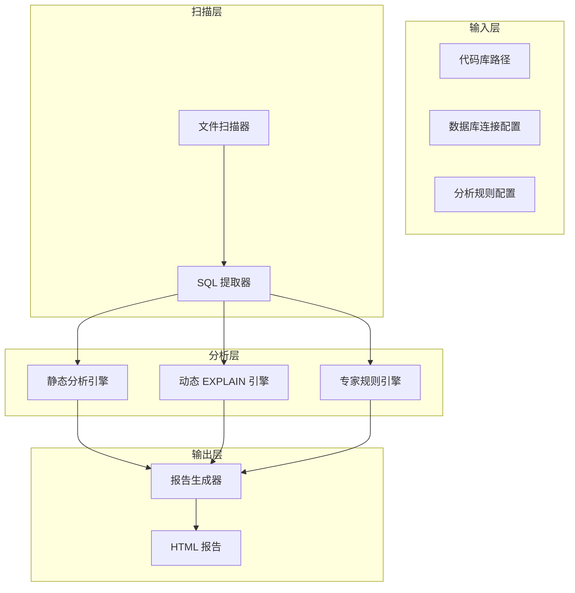
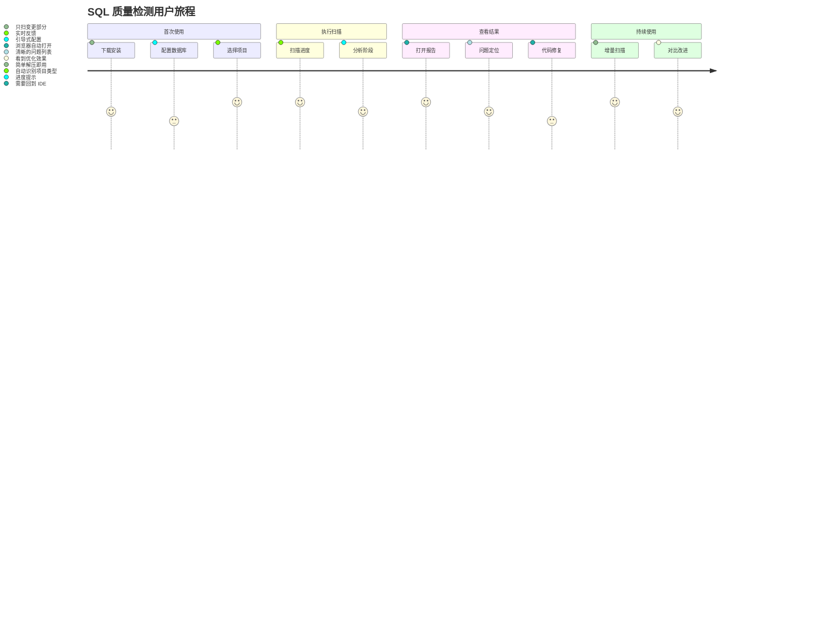

# SQL 质量检测工具 产品需求文档 (PRD)

## 文档信息

| 字段 | 内容 |
|------|------|
| 项目名称 | Spectrum SQL Code Checker (光谱 SQL 质量检测工具) |
| 版本号 | v1.0 (MVP) |
| 创建日期 | 2026-01-23 |
| 状态 | 草稿 |

---

## 0. 需求追溯表

| 需求 ID | 功能名称 | 优先级 |
|---------|----------|--------|
| REQ-001 | 代码库扫描与 SQL 提取 | P0 |
| REQ-002 | 静态 SQL 分析 | P0 |
| REQ-003 | 动态 EXPLAIN 分析 | P0 |
| REQ-004 | 专家规则分析 | P0 |
| REQ-005 | HTML 报告生成 | P0 |
| REQ-006 | 交互式命令行界面 | P0 |
| REQ-007 | 多数据库支持 | P1 |
| REQ-008 | 配置管理 | P1 |
| REQ-009 | 历史报告对比 | P2 |
| REQ-010 | CI/CD 集成 | P2 |

---

## 1. 文档概述

### 1.1 文档目的

本文档旨在：
- 明确 SQL 质量检测工具的功能需求和范围
- 为设计、开发、测试团队提供产品规范
- 作为产品迭代的基准文档

### 1.2 产品定义

**Spectrum SQL Code Checker** 是一个基于 Java 的交互式 SQL 质量检测工具，通过扫描代码库自动识别 SQL 语句，并从静态分析、动态执行计划、专家规则三个维度进行质量检测，最终生成飞书 UI 风格的 HTML 分析报告。

### 1.3 目标读者

- 产品经理
- UI/UX 设计师
- Java 后端开发工程师
- 测试工程师
- DBA

---

## 2. 产品概述

### 2.1 产品背景

#### 问题陈述

在企业软件开发中，SQL 质量问题直接影响系统性能和稳定性：

| 痛点 | 描述 | 影响 |
|------|------|------|
| **SQL 隐患难发现** | 代码中 SQL 分散在各个文件，人工审查效率低 | 性能问题遗漏到生产环境 |
| **缺乏统一标准** | 不同开发人员 SQL 编写风格各异 | 维护成本高 |
| **执行计划不直观** | EXPLAIN 结果难以理解 | 优化门槛高 |
| **报告可读性差** | 现有工具报告风格陈旧 | 团队接受度低 |

#### 市场机会

- Java 仍是企业后端主流语言
- MyBatis/JPA 等 ORM 框架普及，SQL 形式多样
- DevOps 趋势下，代码质量检查工具需求增长
- 飞书 UI 风格受开发团队喜爱，但现有 SQL 工具缺乏此类设计

### 2.2 产品目标

#### 业务目标

| 目标 | 指标 | 时间线 |
|------|------|--------|
| 工具可用性 | 支持主流 Java 项目扫描 | MVP 阶段 |
| 问题检出率 | 覆盖常见 SQL 问题类型 80%+ | MVP 阶段 |
| 用户接受度 | 内部试用满意度 4.0+ | 3 个月 |

#### 产品目标

| 目标 | 指标 |
|------|------|
| 扫描效率 | 万行代码扫描时间 < 30 秒 |
| 分析准确性 | SQL 识别准确率 > 95% |
| 报告可读性 | 非技术人员可理解问题等级 |
| 易用性 | 首次使用 3 分钟内完成扫描 |

### 2.3 目标用户

#### 主要用户：Java 后端开发工程师

| 属性 | 描述 |
|------|------|
| 年龄 | 25-40 岁 |
| 角色 | 后端开发、技术负责人 |
| 技术水平 | 熟悉 Java、SQL、MyBatis/JPA |
| 使用频率 | 每周多次（代码提交前、代码评审时） |
| 核心需求 | 快速发现 SQL 问题、直观的改进建议 |

#### 次要用户：DBA

| 属性 | 描述 |
|------|------|
| 角色 | 数据库管理员 |
| 技术水平 | 精通 SQL、数据库优化 |
| 使用频率 | 每周多次（代码评审、性能优化） |
| 核心需求 | 深度分析、执行计划解读 |

### 2.4 竞争分析

| 产品 | 优势 | 劣势 |
|------|------|------|
| **SonarQube** | 功能全面、社区活跃 | SQL 分析较浅、报告风格传统 |
| **SQLGuard** | 规则丰富 | 商业付费、UI 陈旧 |
| **pt-queryadvisor** | MySQL 专用专业 | 仅 MySQL、无代码扫描 |

---

## 3. 功能需求

### 3.1 功能架构图



### 3.2 核心功能

#### 功能 1：代码库扫描与 SQL 提取 (REQ-001)

**功能描述**：扫描 Java 代码库，自动识别和提取各种形式的 SQL 语句

**用户故事**：
```
作为 Java 开发工程师
我想要工具自动扫描项目代码
以便无需手动查找 SQL 语句
```

**需求详情**：

| 功能点 | 说明 | 优先级 |
|--------|------|--------|
| 支持的 SQL 形式 | MyBatis XML、MyBatis 注解、@Query 注解、字符串拼接、JPA Native Query | P0 |
| 支持的文件类型 | .java、.xml、.sql | P0 |
| SQL 去重 | 相同 SQL 合并，记录出现位置 | P0 |
| SQL 抽象化 | 提取参数化 SQL 模板 | P0 |
| 扫描进度显示 | 实时显示扫描进度 | P0 |
| 增量扫描 | 仅扫描变更文件 | P2 |

**验收标准**：
- [ ] 支持 MyBatis XML 中的 SQL 识别
- [ ] 支持 @Select/@Update 等注解中的 SQL 识别
- [ ] 支持 String 类型变量中的 SQL 识别
- [ ] SQL 识别准确率 > 95%
- [ ] 显示扫描进度百分比

#### 功能 2：静态 SQL 分析 (REQ-002)

**功能描述**：不执行 SQL，通过静态规则分析 SQL 语句质量

**用户故事**：
```
作为 开发工程师
我想要在编写阶段就发现 SQL 问题
以便避免问题代码进入生产环境
```

**需求详情**：

| 功能点 | 说明 | 优先级 |
|--------|------|--------|
| 问题等级分级 | 严重 / 警告 / 提示 三级 | P0 |
| SELECT * 检测 | 检测 SELECT * 使用 | P0 |
| 索引建议 | 检测 WHERE 字段是否有索引 | P0 |
| JOIN 顺序检测 | 检测可疑的 JOIN 顺序 | P0 |
| 子查询检测 | 检测可优化的子查询 | P1 |
| N+1 查询检测 | 检测可能的 N+1 问题 | P1 |
| SQL 注入风险 | 检测字符串拼接风险 | P0 |
| 命名规范检查 | 表名、字段名规范检查 | P2 |

**验收标准**：
- [ ] 每个问题包含：问题类型、位置、建议修改
- [ ] 问题等级用颜色区分（红色/黄色/蓝色）
- [ ] 误报率 < 10%

#### 功能 3：动态 EXPLAIN 分析 (REQ-003)

**功能描述**：连接数据库执行 EXPLAIN，解析执行计划

**用户故事**：
```
作为 DBA
我想要查看 SQL 的真实执行计划
以便发现性能瓶颈
```

**需求详情**：

| 功能点 | 说明 | 优先级 |
|--------|------|--------|
| EXPLAIN 执行 | 自动执行 EXPLAIN 命令 | P0 |
| 执行计划解析 | 解析 type、key、rows 等关键字段 | P0 |
| 全表扫描检测 | 检测 type = ALL 的情况 | P0 |
| 索引使用检测 | 检测 key = NULL 的情况 | P0 |
| 扫描行数预警 | rows 超过阈值时告警 | P0 |
| 临时表检测 | 检测 Using temporary | P1 |
| 文件排序检测 | 检测 Using filesort | P1 |

**验收标准**：
- [ ] 支持 MySQL EXPLAIN 格式
- [ ] 执行计划以表格形式展示
- [ ] 每个指标包含解释说明
- [ ] EXPLAIN 执行超时时间 30 秒

#### 功能 4：专家规则分析 (REQ-004)

**功能描述**：基于预定义的专家规则库，给出深度分析建议

**用户故事**：
```
作为 技术负责人
我想要获得专家级的优化建议
以便指导团队改进代码
```

**需求详情**：

| 功能点 | 说明 | 优先级 |
|--------|------|--------|
| 专家规则库 | 内置 50+ 条 SQL 最佳实践规则 | P0 |
| 规则匹配 | 自动匹配适用的规则 | P0 |
| 优化建议 | 给出具体的优化方案 | P0 |
| 参考文档 | 每条建议附带参考链接 | P1 |
| 自定义规则 | 支持用户扩展规则库 | P2 |

**验收标准**：
- [ ] 每条 SQL 匹配至少一条规则
- [ ] 建议具体可执行
- [ ] 规则可配置开启/关闭

#### 功能 5：HTML 报告生成 (REQ-005)

**功能描述**：生成飞书 UI 风格的 HTML 分析报告

**用户故事**：
```
作为 开发工程师
我想要查看美观易读的分析报告
以便快速了解问题并采取行动
```

**需求详情**：

| 功能点 | 说明 | 优先级 |
|--------|------|--------|
| 飞书 UI 风格 | 采用飞书设计系统的配色和组件样式 | P0 |
| 报告结构 | 概览 → 问题详情 → 统计图表 | P0 |
| SQL 结果表格 | 包含：SQL 抽象、SQL 原文、静态分析等级、静态分析明细、动态执行计划、动态执行计划解析、专家分析 | P0 |
| 问题等级标签 | 严重(红色)/警告(橙色)/提示(蓝色) | P0 |
| 交互式展开 | 点击行展开详细信息 | P0 |
| 代码位置跳转 | 显示 SQL 在代码中的位置 | P0 |
| 统计图表 | 问题分布饼图、Top 问题柱状图 | P0 |
| 导出功能 | 支持导出 PDF | P1 |

**报告表格结构**：

| 列名 | 说明 |
|------|------|
| SQL 抽象 | 参数化后的 SQL 模板 |
| SQL 原文 | 原始 SQL 语句 |
| 静态分析等级 | 严重 / 警告 / 提示 |
| 静态分析明细 | 静态检测到的问题列表 |
| 动态执行计划 | EXPLAIN 结果表格 |
| 动态执行计划解析 | 执行计划的解读分析 |
| 专家分析 | 专家规则的匹配和建议 |

**验收标准**：
- [ ] HTML 报告可在浏览器直接打开
- [ ] UI 风格与飞书一致
- [ ] 表格支持排序和筛选
- [ ] 报告加载时间 < 2 秒

#### 功能 6：交互式命令行界面 (REQ-006)

**功能描述**：提供友好的交互式 CLI 操作界面

**用户故事**：
```
作为 开发工程师
我想要通过简单的命令完成检测
以便快速获得分析结果
```

**需求详情**：

| 功能点 | 说明 | 优先级 |
|--------|------|--------|
| 引导式配置 | 首次运行引导配置数据库连接 | P0 |
| 命令参数 | 支持命令行参数指定扫描路径 | P0 |
| 进度显示 | 实时显示各阶段进度 | P0 |
| 彩色输出 | 终端输出使用颜色区分等级 | P0 |
| 配置保存 | 保存配置供下次使用 | P0 |
| 批量模式 | 支持非交互式批量运行 | P1 |

**验收标准**：
- [ ] 首次使用有引导提示
- [ ] 每步操作有明确反馈
- [ ] 支持输入验证和错误提示

#### 功能 7：多数据库支持 (REQ-007)

**功能描述**：支持多种数据库类型的 EXPLAIN 分析

**需求详情**：

| 功能点 | 说明 | 优先级 |
|--------|------|--------|
| MySQL | 支持 MySQL 5.7+ | P0 |
| PostgreSQL | 支持 PostgreSQL 12+ | P1 |
| 其他数据库 | Oracle、SQL Server 等 | P3 |

#### 功能 8：配置管理 (REQ-008)

**功能描述**：支持灵活的规则配置

**需求详情**：

| 功能点 | 说明 | 优先级 |
|--------|------|--------|
| 规则开关 | 可单独开启/关闭每条规则 | P0 |
| 阈值配置 | 可配置扫描行数等阈值 | P0 |
| 配置文件 | 支持 YAML/JSON 配置文件 | P0 |
| 配置模板 | 提供默认配置模板 | P1 |

#### 功能 9：历史报告对比 (REQ-009)

**功能描述**：支持多次扫描结果的对比

**需求详情**：

| 功能点 | 说明 | 优先级 |
|--------|------|--------|
| 报告存档 | 自动保存历史报告 | P2 |
| 差异对比 | 对比两次扫描的差异 | P2 |
| 趋势分析 | 展示质量变化趋势 | P2 |

#### 功能 10：CI/CD 集成 (REQ-010)

**功能描述**：支持在 CI/CD 流程中使用

**需求详情**：

| 功能点 | 说明 | 优先级 |
|--------|------|--------|
| 退出码 | 有严重问题时返回非 0 退出码 | P2 |
| 评审格式 | 支持 GitLab/GitHub 评审格式 | P2 |
| 产物上传 | 支持 HTML 报告上传 | P2 |

---

## 4. 用户体验设计

### 4.1 用户旅程



### 4.2 关键界面设计

#### 界面 1：交互式启动流程

```
┌─────────────────────────────────────────────────────────────────┐
│  ___                              _           _        ___       │
│ | _ \ __ _  ___  ___ _ __ __ _   | |__  __ _| |__    / _ \ _ __ │
│ |  _// _` |/ _ \/ _ \ '__/ _` |  | '_ \/ _` | '_ \  | | | | '_ \│
│ |_| \__,_|\___/\___|_|  \__,_|  |_.__/\__,_|_.__/  | |_| | |_)||
│                                                           \___/ │
│                                                                   │
│  欢迎使用 Spectrum SQL Checker v1.0                               │
│                                                                   │
│  首次使用，让我们来配置一下...                                     │
│                                                                   │
│  [1/4] 请输入代码库路径: [/Users/xxx/project] ___________________ │
│                                                                   │
│  ✓ 自动检测到: Maven + MyBatis 项目                                │
│                                                                   │
│  [2/4] 数据库类型:                                                │
│      ● MySQL  (推荐)                                              │
│      ○ PostgreSQL                                                 │
│      ○ 跳过 EXPLAIN 分析                                          │
│                                                                   │
│  [3/4] 数据库连接:                                                │
│      主机: [localhost          ]                                  │
│      端口: [3306               ]                                  │
│      数据库: [test_db            ]                                  │
│      用户名: [root               ]                                  │
│      密码: [••••••••            ]                                  │
│                                                                   │
│  [连接测试] ✓ 连接成功                                            │
│                                                                   │
│  [4/4] 开始扫描                                                    │
│      扫描范围: ● 全部  ○ 仅 src 目录                               │
│      输出文件: [sql-report-20260123.html]                         │
│                                                                   │
│                              [开始扫描]  [取消]                   │
└─────────────────────────────────────────────────────────────────┘
```

#### 界面 2：扫描进度

```
┌─────────────────────────────────────────────────────────────────┐
│  正在扫描...                                                      │
│                                                                   │
│  [████████████████████░░░░░░░░░░] 75%                             │
│                                                                   │
│  ✓ 已扫描 150 个文件                                              │
│  → 正在分析: com/example/mapper/UserMapper.xml                    │
│                                                                   │
│  已发现 45 条 SQL 语句                                            │
│  已检测到 8 个问题                                                │
│                                                                   │
│  预计剩余时间: 10 秒                                              │
└─────────────────────────────────────────────────────────────────┘
```

#### 界面 3：HTML 报告页面布局

```
┌─────────────────────────────────────────────────────────────────┐
│  ☰ Spectrum SQL Checker          项目: demo-service    [导出PDF] │
├─────────────────────────────────────────────────────────────────┤
│                                                                   │
│  ┌─────────────────────────────────────────────────────────────┐│
│  │  扫描概览                                                     ││
│  │  ┌──────────┐ ┌──────────┐ ┌──────────┐ ┌──────────┐       ││
│  │  │   45     │ │   8      │ │   3      │ │   12s    │       ││
│  │  │ SQL 语句  │ │   问题   │ │  严重    │ │ 扫描耗时  │       ││
│  │  └──────────┘ └──────────┘ └──────────┘ └──────────┘       ││
│  └─────────────────────────────────────────────────────────────┘│
│                                                                   │
│  ┌─────────────────────────────────────────────────────────────┐│
│  │  问题分布                                                     ││
│  │  [饼图: 严重 25% | 警告 50% | 提示 25%]                      ││
│  └─────────────────────────────────────────────────────────────┘│
│                                                                   │
│  ┌─────────────────────────────────────────────────────────────┐│
│  │  SQL 分析结果                          [筛选 ▼]  [排序 ▼]    ││
│  ├─────────────────────────────────────────────────────────────┤│
│  │ SQL 抽象              │ 静态分析 │ 动态分析 │ 专家分析      ││
│  ├─────────────────────────────────────────────────────────────┤│
│  │ SELECT * FROM users │ [🔴严重] │ [⚠️警告] │ [优化建议]     ││
│  │ WHERE status = ?     │          │          │                ││
│  │ ├─ SELECT * 检测     │          │          │                ││
│  │ ├─ 无索引            │          │          │                ││
│  │ └─ 全表扫描          │          │          │                ││
│  │ [查看详情]           │          │          │                ││
│  ├─────────────────────────────────────────────────────────────┤│
│  │ SELECT id,name...    │ [🟡提示] │ [✓正常]  │ [良好实践]     ││
│  │ WHERE id = ?         │          │          │                ││
│  │ └─ 建议指定字段      │          │          │                ││
│  │ [查看详情]           │          │          │                ││
│  └─────────────────────────────────────────────────────────────┘│
└─────────────────────────────────────────────────────────────────┘
```

### 4.3 飞书 UI 风格规范

| 元素 | 飞书规范说明 |
|------|-------------|
| 主色调 | 蓝色 #3370FF |
| 成功色 | 绿色 #00C675 |
| 警告色 | 橙色 #FF8800 |
| 错误色 | 红色 #F54A45 |
| 文本色 | 深灰 #1F2329 |
| 边框色 | 浅灰 #DEE0E3 |
| 背景色 | 白色 #FFFFFF / 浅灰 #F5F6F7 |
| 圆角 | 4px / 8px |
| 字体 | -apple-system, BlinkMacSystemFont, 'Segoe UI' |

---

## 5. 实施计划

### 5.1 迭代规划

#### MVP 版本 (v1.0)

功能范围：
- REQ-001 代码库扫描与 SQL 提取
- REQ-002 静态 SQL 分析
- REQ-003 动态 EXPLAIN 分析（仅 MySQL）
- REQ-004 专家规则分析
- REQ-005 HTML 报告生成
- REQ-006 交互式命令行界面

里程碑：
- Week 1-2: SQL 提取器 + 静态分析引擎
- Week 3-4: EXPLAIN 引擎 + 专家规则库
- Week 5-6: HTML 报告生成
- Week 7-8: CLI 界面 + 集成测试

#### 增强版 (v1.5)

新增功能：
- REQ-007 多数据库支持（PostgreSQL）
- REQ-008 配置管理增强
- UI/UX 优化

#### 企业版 (v2.0)

新增功能：
- REQ-009 历史报告对比
- REQ-010 CI/CD 集成
- Web UI 界面

### 5.2 风险与应对

| 风险 | 可能性 | 影响 | 应对措施 |
|------|--------|------|----------|
| SQL 识别准确率不足 | 中 | 高 | 收集真实项目测试，持续优化识别规则 |
| 数据库连接安全 | 低 | 高 | 密码加密存储，不保存连接日志 |
| 执行计划解析兼容性 | 中 | 中 | 先支持主流版本，逐步扩展 |

---

## 6. 成功指标

### 6.1 业务指标

| 指标 | 目标值 | 测量方法 |
|------|--------|----------|
| 内部使用率 | 80%+ Java 项目 | 使用统计 |
| 问题发现率 | 每次扫描平均发现 5+ 问题 | 数据统计 |
| 用户满意度 | 4.0+ 评分 | 问卷调研 |

### 6.2 产品指标

| 指标 | 目标值 | 测量方法 |
|------|--------|----------|
| SQL 识别准确率 | > 95% | 测试集验证 |
| 万行代码扫描时间 | < 30 秒 | 性能测试 |
| 误报率 | < 10% | 人工抽检 |
| 报告加载时间 | < 2 秒 | 性能测试 |

---

## 7. 非功能需求

### 7.1 性能要求

| 指标 | 目标值 |
|------|--------|
| 万行代码扫描时间 | < 30 秒 |
| 单条 SQL 分析时间 | < 500 毫秒 |
| HTML 报告加载时间 | < 2 秒 |
| 内存占用 | < 512 MB |

### 7.2 兼容性要求

| 指标 | 要求 |
|------|------|
| Java 版本 | JDK 11+ |
| 操作系统 | Windows / macOS / Linux |
| 数据库 | MySQL 5.7+, PostgreSQL 12+ |
| 浏览器 | Chrome 90+, Firefox 88+, Safari 14+ |

### 7.3 安全要求

| 指标 | 要求 |
|------|------|
| 密码存储 | 加密存储（AES-256） |
| SQL 注入防护 | 只读分析，不修改数据 |
| 敏感信息 | 报告中脱敏处理 |

---

**文档结束**
